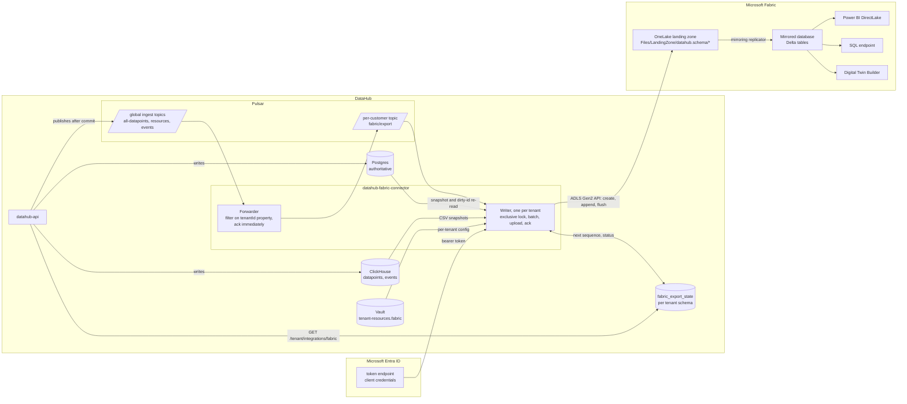
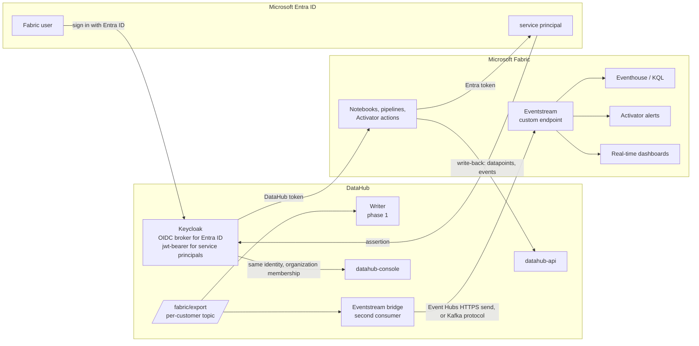
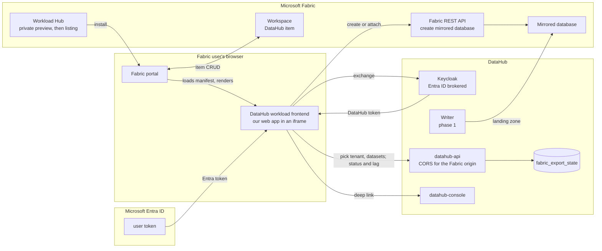
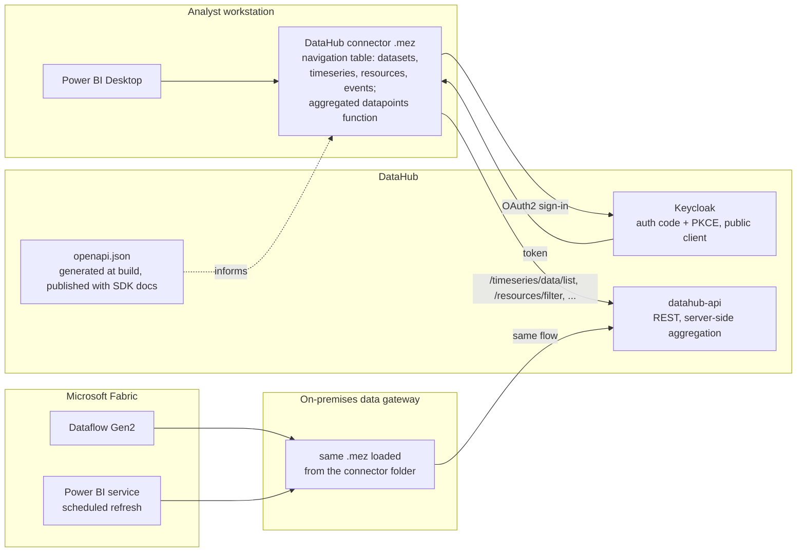

# Microsoft Fabric integration

A proposal for making DataHub a data source for Microsoft Fabric, so that everything a customer
curates in DataHub (assets, timeseries, events, the graph between them) shows up in Power BI and
the rest of Fabric without anyone writing an import script. Nothing in this document is built
yet. It describes what we would build, in four phases, so the work can be split into pull
requests.

> **Status: proposal.** The Fabric details were checked against the Microsoft Learn
> documentation in August 2026 (see [Sources](#sources)). The DataHub details were read from the
> code, and the relevant files are named. The [open questions](#open-questions) need answers
> before phase 1 starts.

## Why

### The business case

In the markets we sell into, Microsoft is the default. The industrial companies, utilities and
public-sector organisations we talk to run on Microsoft 365, sign in with Entra ID, report in
Power BI, and increasingly have a Fabric capacity because it came with the Power BI licence
they already pay for. Their IT departments have approved Microsoft; anything else has to earn
its place. That shapes how DataHub gets bought:

- **The buyer's question is "how does this fit with what we have".** A product that feeds
  Power BI and Fabric is an addition to an approved platform. A product that asks people to
  open a new tool for reports is a replacement, and replacements lose. Fabric support turns
  DataHub from the second kind into the first.
- **We do not compete with Fabric, we complete it.** Fabric is an analytics platform; it has no
  opinion about what a pump, a well or a substation is, how tags relate to equipment, or what
  counts as a valid reading. DataHub is that layer. "DataHub curates the industrial data, Fabric
  analyses it" is a story a Microsoft-first buyer accepts, and it answers the objection we hear
  most often: "we already have Fabric, why do we need you".
- **Once reports depend on it, DataHub is in the daily workflow.** A Power BI report that
  management looks at every Monday is a stronger reason to keep paying than an API nobody sees.
  The mirrored tables make DataHub the source those reports are built on.
- **It is a distribution channel.** Fabric's Workload Hub and the published list of Open
  Mirroring partners put DataHub in front of every Fabric customer's admin, which is a kind of
  reach we cannot buy. Microsoft's partner programmes are built around exactly this.
- **The data stays where the customer put it.** DataHub remains open source and self-hosted;
  Fabric gets a copy of whatever datasets the customer chooses to mirror. That matches the data
  residency and sovereignty requirements we already sell on, rather than conflicting with them.

### Why the return is good

The cost side is small for what it buys:

- **Phase 1 is one backend service and a handful of small changes.** No new dependencies, no
  new infrastructure, no user interface. It reuses Vault, Pulsar, Postgres and ClickHouse
  exactly as they are used today.
- **One integration reaches the whole Fabric user base.** Power BI, Spark notebooks, the SQL
  endpoint, Digital Twin Builder and Copilot all read the same mirrored tables. We do not build
  a connector per tool.
- **Microsoft maintains the hard parts.** Open Mirroring takes our change files and maintains
  the Delta tables, the SQL endpoint and the Power BI model; the mirrored storage is free up to
  a generous limit. We write files; Fabric does the rest.
- **The tables are open.** Because OneLake exposes them as Delta and Iceberg, the same export
  serves customers on other lakehouse platforms without separate work.
- **It de-risks the sale more than it costs.** A prospect who can see DataHub data in Power BI
  on day one of a pilot has something to show their management. That shortens pilots and
  removes the "we will have to build the reporting ourselves" line item from their side.

The phases after the first (live data, sign-in with a Microsoft account, the Fabric workload)
build on the same foundation and can each be justified by a customer asking for them.

### The gap today

Today the only way to get DataHub data into Fabric is to write your own client against the REST
API and page the JSON into a notebook. That has four problems:

- The assets, timeseries and events in DataHub are invisible to the Power BI and Copilot users
  in the organisation.
- Every customer builds the same fragile import script, and none of them handle updates and
  deletes correctly.
- There is no way to get live data (alerts, real-time dashboards).
- DataHub is not listed in Fabric's Workload Hub, so organisations that start from Fabric never
  find it.

Fabric now has stable, documented ways for an outside product to plug in. This is an engineering
task, not research.

## User stories

The people involved, and what each of them needs. Each story names the phase that delivers it,
so the phases below can be read as "which of these does this step satisfy". Acceptance notes
say what "done" looks like.

### Customer side

**Power BI analyst**

1. *As an analyst, I want the DataHub assets, timeseries and events for my plant to show up as
   tables in Fabric, so that I can build Power BI reports on them without asking a developer.*
   Phase 1. Done when the six tables appear in a mirrored database and a report built on them in
   Direct Lake mode refreshes without any manual step.
2. *As an analyst, I want the tables to stay current, so that my reports show what DataHub shows.*
   Phase 1. Done when a value written through the DataHub API is visible in the mirrored table
   within minutes, and a deleted resource disappears from it.
3. *As an analyst, I want to join datapoints to their timeseries and assets, so that I can
   group and filter by plant, unit or tag.* Phase 1. Done when `datapoints.timeseries_id`,
   `timeseries.data_set_id` and `relationships` carry the ids needed for those joins.
4. *As an analyst, I want to pull aggregated datapoints from DataHub into Power BI Desktop
   directly, so that I can explore without waiting for a mirror to be set up.* Phase 4.

**Data engineer or data scientist**

5. *As a data engineer, I want to read DataHub data from a Spark notebook in Fabric, so that I
   can combine it with the rest of our lakehouse.* Phase 1. Done when the mirrored tables are
   readable from a notebook and from the SQL endpoint.
6. *As a data engineer, I want to read the same tables from tools outside Fabric, so that we are
   not locked in.* Phase 1, free with OneLake's Iceberg metadata. Done when an Iceberg or Delta
   reader outside Fabric opens a mirrored table.
7. *As a data scientist, I want to write results (a computed timeseries, a detected event) back
   into DataHub from a notebook, so that they show up in the console and the graph.* Phase 2.
   Done when a notebook can get a DataHub token with a Microsoft identity and call the ingest
   endpoints.
8. *As a data engineer, I want to map DataHub's asset graph into Digital Twin Builder, so that
   the twin uses the ontology we already maintain in DataHub.* Phase 1 (documentation). Done
   when the mapping guide takes someone from the mirrored tables to a working twin.

**Operations engineer**

9. *As an operations engineer, I want live datapoints and events in a real-time dashboard and
   in alerts, so that I can act on them as they happen rather than after the next refresh.*
   Phase 2. Done when an eventstream receives DataHub datapoints and an Activator rule on it
   fires.

**Fabric administrator**

10. *As a Fabric admin, I want to set the integration up with one app registration and one
    workspace permission, so that it follows the same security model as everything else in our
    tenant.* Phase 1. Done when the operator guide needs nothing from the customer beyond the
    app registration, the workspace role and the two tenant settings.
11. *As a Fabric admin, I want the DataHub data to respect workspace permissions, so that only
    the right people see it.* Phase 1. Done when access to the mirrored database is governed
    purely by Fabric workspace and item permissions.
12. *As a Fabric admin, I want to find DataHub in the Workload Hub and enable it for a workspace,
    so that I do not have to install or host anything.* Phase 3.
13. *As a Fabric admin, I want to sign in to the DataHub console with my Microsoft account, so
    that there is one identity to manage.* Phase 2.

**Fabric user of the DataHub workload**

14. *As a Fabric user, I want to choose which DataHub datasets are mirrored into my workspace
    and see whether the mirror is healthy, from inside Fabric, so that I do not need access to
    DataHub's own tools.* Phase 3. Done when the workload item lets a user pick a tenant and
    datasets, create or attach the mirrored database, and see lag and last error.

### DataHub side

**DataHub operator (whoever runs the platform for a customer)**

15. *As an operator, I want to enable Fabric export for one tenant by adding a block to its
    Vault entry, so that it follows the way every other per-tenant setting works.* Phase 1.
    Done when adding the `fabric` block is the only configuration step.
16. *As an operator, I want to be sure that a Fabric outage, an expired secret or a
    misconfigured tenant cannot slow down or stop ingest for any tenant, so that the integration
    cannot take the platform down.* Phase 1. Done when stopping the writer for a tenant leaves
    API ingest for all tenants unaffected, with only that tenant's export lagging.
17. *As an operator, I want to see per-tenant export status (lag, last file, last error) from
    the console or an endpoint, so that I can answer "is the mirror up to date" without reading
    logs.* Phase 1.
18. *As an operator, I want to rebuild a table, a timeseries or a year of datapoints on demand,
    so that I can fix drift without a full re-export.* Phase 1.
19. *As an operator, I want the exporter to run on the same hosts, with the same Vault, systemd
    and container packaging as the other services, so that there is nothing new to operate.*
    Phase 1.

**DataHub developer**

20. *As a developer, I want the exporter to read from Postgres and ClickHouse directly rather
    than through the REST API, so that a full load of a large tenant finishes in minutes, not
    hours.* Phase 1.
21. *As a developer, I want no Azure SDK and no Parquet library in the build, so that the
    dependency footprint stays small and the build stays fast.* Phase 1.
22. *As a developer, I want Postgres to remain the single source of truth, so that the mirror
    can always be rebuilt from it and never has to be migrated or repaired on its own.* Phase 1.

**IntelliStream (the product)**

23. *As the product owner, I want Fabric export to be a feature that can be switched on per
    tenant, so that it can be sold as an add-on or bundled later without a code change.*
    Phase 1.
24. *As the product owner, I want DataHub listed in the Fabric Workload Hub, so that Fabric
    customers discover it without us calling them first.* Phase 3.

### Stories we are deliberately not taking on

- Using OneLake as the file store for DataHub's own files.
- Running DataHub's own queries (console, API, analysis) against Fabric instead of ClickHouse
  and Neo4j.
- Propagating datapoint deletes exactly in every case. Deletes of a time window are propagated;
  deleting a whole timeseries leaves its points in the mirror until the next scheduled rebuild,
  and consumers are expected to join against `timeseries`.

## Fabric concepts you need for this document

None of us has used Fabric. This section is the minimum vocabulary for reviewing the plan,
written for people who work on Linux and open-source software. Skip what you already know.

### The product

- **Microsoft Fabric** is a software-as-a-service analytics platform. It bundles storage
  (OneLake), several query engines, data pipelines, real-time streaming and Power BI into one web
  portal at `app.fabric.microsoft.com`. Nothing runs on the customer's machines; there is nothing
  to install. It is sold separately from Azure, although it runs on Azure and uses Azure's
  identity service.
- **Capacity.** The compute you pay for. A capacity is a pool of "capacity units" (CU) bought as
  a size, `F2` up to `F2048`. Every workspace is attached to one capacity, and everything that
  runs in the workspace (queries, Spark jobs, Power BI refreshes, mirroring reads) draws from it.
  A paused capacity stops everything in its workspaces, including our mirroring. A free 60-day
  trial capacity (64 CU) exists for evaluation.
- **Tenant.** One per organisation, tied to the organisation's Microsoft Entra ID directory. It
  holds the single OneLake and all workspaces. Tenant-wide switches live in the **admin portal**;
  two of them matter to us (*Service principals can use Fabric APIs*, and *Users can access data
  stored in OneLake with apps external to Fabric*). A customer's Fabric admin has to flip them.
- **Workspace.** A folder with its own members and permissions (Admin, Member, Contributor,
  Viewer), attached to one capacity. Everything a user creates lives in a workspace. Our
  mirrored database is one item in a workspace the customer chooses.
- **Item.** Anything in a workspace: a lakehouse, a warehouse, a mirrored database, a notebook,
  a report. Items have a type, an id, and a folder in OneLake. The Extensibility Toolkit lets a
  partner define new item types, which is how a "DataHub" item would appear next to the built-in
  ones.

### Storage and tables

- **OneLake.** Fabric's one storage account per tenant, explained in the next section.
- **Parquet.** The column-oriented file format everything here is built on. One file holds
  rows for a set of columns, compressed per column. Open, widely supported, including by
  ClickHouse.
- **Delta Lake table** (usually just "Delta table"). A folder of Parquet files plus a
  `_delta_log` folder with a JSON transaction log. The log says which files make up the current
  version, so writers can add, replace and delete files atomically and readers can time-travel.
  Fabric's native table format. Apache Iceberg is the competing open standard for the same idea.
- **Lakehouse.** A Fabric item that is a folder in OneLake with a `Tables` area (Delta tables)
  and a `Files` area (anything). Spark notebooks work against lakehouses. Digital Twin Builder
  reads from one.
- **Warehouse.** A Fabric item that feels like a SQL Server database (T-SQL, transactions) but
  stores its tables as Delta in OneLake.
- **Mirrored database.** A Fabric item that holds a continuously updated copy of an external
  database as Delta tables. Open Mirroring is the variant where we, not Microsoft, write the
  change files. Our exporter creates and feeds one of these.
- **Landing zone.** The `Files/LandingZone` folder inside a mirrored database where the change
  files go. Fabric's replicator watches it and folds the files into the Delta tables.
- **SQL analytics endpoint.** A read-only T-SQL endpoint that every lakehouse and mirrored
  database gets automatically. It speaks the SQL Server protocol (TDS), so `sqlcmd` and JDBC
  work, but plain HTTP does not.
- **Shortcut.** A symlink inside OneLake to data that lives somewhere else (another workspace,
  S3, ADLS). Not useful to us because DataHub does not store files in an object store.

### Reporting and real time

- **Power BI.** Microsoft's reporting tool, now part of Fabric. Reports are built on a
  **semantic model** (formerly "dataset"): a set of tables, relationships and measures. A
  semantic model can copy data in (import mode), query the source per click (DirectQuery), or
  read Delta tables in OneLake directly (**Direct Lake**, the fast path). Direct Lake only works
  on Delta tables, which is why we want one `datapoints` table and not seven.
- **Real-Time Intelligence.** Fabric's streaming side. An **Eventstream** is a managed Event
  Hubs (Azure's Kafka-like message service) with a visual pipeline. A **custom endpoint** on an
  eventstream gives you a connection string to push into it using the Event Hubs, AMQP or Kafka
  protocol. An **Eventhouse** holds **KQL databases**, a time-series store queried with the Kusto
  Query Language; eventstreams usually end there. **Activator** watches a stream and triggers
  alerts or actions when a condition holds.
- **Digital Twin Builder.** A Fabric item where the customer defines an ontology (entity types,
  properties, relationships) and binds it to lakehouse tables, including time series. Still in
  preview.
- **Dataflow Gen2** and **pipelines.** Fabric's low-code ETL (Power Query based) and
  orchestration (Data Factory based). Relevant only for the Power Query connector in phase 4.
- **Notebook.** A Spark notebook (PySpark, Scala, SQL, R) running on Fabric's Spark. This is
  where a customer would call our REST API from inside Fabric.

### Identity

- **Microsoft Entra ID** is the new name for Azure Active Directory: the identity provider
  for every Microsoft cloud tenant. Users, groups and applications live there. Fabric has no
  users of its own; every Fabric login is an Entra login.
- **App registration** is how you create an OAuth2 client in Entra. It has an application
  (client) id and a client secret or certificate. Registering one creates a **service
  principal**, the identity that the app acts as in a given tenant. Our exporter authenticates
  as a service principal the customer registers. Note that the service principal's *object id*
  and the *application id* are different values; `EntraID.md` has been bitten by that.
- **Scopes** such as `https://storage.azure.com/.default` name the API a token is for. A token
  for OneLake is not valid for the Fabric REST API and vice versa; the exporter needs both.
- **On-behalf-of** and **token exchange.** Flows where a service turns a user's token into a
  token for another API. The Keycloak side of that is the `jwt-bearer` grant in `EntraID.md`.

### Extending Fabric

- **Workload.** Fabric's word for a product area (Data Engineering, Data Warehouse, Power BI).
  The **Extensibility Toolkit** lets a partner add one: a web app that Fabric loads in an iframe,
  with a manifest that declares the item types it provides. The partner hosts the app; Fabric
  supplies Entra tokens and a host API for navigation and notifications. The **Workload Hub** is
  the catalogue where customers find and enable workloads. The old name for the toolkit is the
  Workload Development Kit; the docs still use both.
- **Fabric REST API.** `https://api.fabric.microsoft.com`, for creating and managing
  workspaces and items, including mirrored databases. Authenticated with an Entra token.
- **OneLake API.** The ADLS Gen2 REST API at `https://onelake.dfs.fabric.microsoft.com`, for
  reading and writing files. Also authenticated with an Entra token, but for a different scope.

### What works from Linux

- Everything in phases 1 and 2 is REST over HTTPS: Entra token endpoint, OneLake, Fabric REST
  API, Event Hubs. No Microsoft SDK is required, and the exporter is a normal Java service.
- The Azure CLI (`az`) and the Fabric CLI (`fab`, `pip install ms-fabric-cli`) both run on
  Linux and are enough to script app registrations, workspaces and items for testing.
- The Extensibility Toolkit starter kit is Node.js and TypeScript and supports Linux for local
  development; it also needs PowerShell 7 (`pwsh`) and the .NET SDK for its dev gateway.
- The Power Query SDK and the on-premises data gateway are Windows-only, and Power BI Desktop
  is a Windows application. Phase 4 cannot be developed or tested on Linux. That is one more
  reason it is last.
- To try anything for real we need a Fabric tenant with a capacity. The free trial gives 60
  days and 64 CU; after that the smallest paid capacity (`F2`) is enough for development.

## What OneLake is

OneLake is the storage layer of Microsoft Fabric. Every Fabric tenant gets exactly one; it is
created automatically, cannot be deleted, and there is no infrastructure to manage. Think of it
as one big, organisation-wide folder tree in the cloud that every Fabric tool reads from and
writes to. Since our exporter writes into it and everything downstream reads from it, it is
worth understanding on its own.

- **It is Azure Data Lake Storage underneath.** Any tool that speaks the ADLS Gen2 API can read
  and write it. A Fabric workspace appears as a container, and each item in the workspace
  (a lakehouse, a warehouse, a mirrored database) as a folder inside it. That API is what our
  exporter uses.
- **Tables are stored in an open format.** A table is a folder of Parquet files plus a
  transaction log. The native format is Delta Lake; Apache Iceberg is also supported, and OneLake
  generates the metadata of the other format automatically, so a Delta table can be read by an
  Iceberg client and an Iceberg table by every Fabric engine.
- **One copy, many engines.** Spark notebooks, the T-SQL warehouse, the KQL engine and Power BI
  (in Direct Lake mode) all read the same files. Nothing is copied between them.
- **Shortcuts** are references to data that lives somewhere else (another workspace, an S3 or
  ADLS bucket, an Iceberg table in another system). The data stays where it is and shows up in
  OneLake as if it were local.
- **Mirroring** is the opposite: a managed, continuous copy of an external database into
  OneLake as Delta tables. Open Mirroring is the variant where we write the change files
  ourselves. Mirrored storage is free up to a limit tied to the capacity size (one terabyte per
  capacity unit), and the replication itself does not consume capacity. Querying it does.
- **Security** is defined once, per folder, table, row or column, and enforced by every engine.

### OneLake compared to other systems

These are not all the same kind of thing, which is the main source of confusion. A table format
is a specification; a data lake is storage; a warehouse or an OLAP database is storage plus a
query engine.

| | What it is | Who owns the storage | Table or file format | Query engine | Relation to DataHub |
|---|---|---|---|---|---|
| **OneLake** | A managed data lake, one per Fabric tenant | Microsoft, inside the Fabric tenant | Delta Lake (native) and Iceberg, both on Parquet | None of its own; Fabric's engines (Spark, T-SQL, KQL, Power BI) read it | Where our exporter lands the data. A derived copy, never the source of truth. |
| **Apache Iceberg** | An open table format: a spec for how Parquet files and metadata make up a table with ACID commits, schema evolution and time travel | Whoever runs the object store (S3, ADLS, GCS) | Iceberg on Parquet (also ORC, Avro) | None; Spark, Trino, Flink, Snowflake, ClickHouse and others implement readers and writers | Not used directly. Because OneLake virtualises Delta tables as Iceberg, the tables we mirror can also be read by Iceberg clients outside Fabric. |
| **Snowflake** | A cloud data warehouse | Snowflake, in its own managed storage, or the customer's bucket for Iceberg tables | Proprietary micro-partitions, or Iceberg for external tables | Snowflake's own SQL engine | A possible second consumer of the mirrored tables through OneLake's Iceberg view. Fabric can also mirror Snowflake into OneLake. Not something we export to directly. |
| **Databricks** | A lakehouse platform: Spark compute plus a catalog (Unity Catalog) over the customer's object storage | The customer's own S3, ADLS or GCS bucket | Delta Lake (its own format), reads Iceberg | Spark and Databricks SQL | Same position as Snowflake: can read the mirrored Delta tables through a shortcut or Unity Catalog, and Fabric can mirror Unity Catalog metadata into OneLake. |
| **ClickHouse** | An OLAP database: a column-oriented engine with its own storage format, built for fast aggregation over very large tables | The server's local disks (or object storage it manages) | MergeTree, proprietary; can read and write Parquet, and can read Iceberg and Delta tables | ClickHouse's own SQL engine | DataHub's hot store for datapoints and events. Stays that way. It also produces the CSV and Parquet files the exporter uploads. |

What this means for the design:

- ClickHouse and Postgres remain the systems of record. OneLake gets a copy for the Fabric user
  base, the same way the WebSocket fan-out gives other consumers a live feed.
- We write plain files in an open format. We do not need a Delta or Iceberg library: Fabric
  builds the Delta table and the Iceberg metadata from the files we upload.
- Once the tables are in OneLake, they are not locked to Fabric. Snowflake, Databricks, Trino or
  DuckDB can read them through the Iceberg or Delta metadata, so the exporter is also a path to
  those platforms without separate connectors.

## How an outside product can plug into Fabric

Fabric has several integration points. This table lists the ones that matter for DataHub.

| Fabric feature | What it does | What it means for DataHub |
|---|---|---|
| **Open Mirroring** (generally available) | We upload change files (Parquet or CSV) to a folder in OneLake, Fabric's storage. Fabric turns them into queryable tables, a SQL endpoint and a Power BI model. | The main path. Full load plus incremental updates and deletes, no work on the customer side, and the storage is free. |
| **Eventstream custom endpoint** | An endpoint that speaks the Event Hubs, AMQP or Kafka protocol. Whatever we send shows up in Fabric's real-time tools: KQL databases, alerts (Activator), live dashboards. | Live datapoints and events. |
| **Digital Twin Builder** (preview) | Lets the customer define entity types and relationships and attach time series to them, using tables from a lakehouse. | Reads the tables we mirror. DataHub's asset graph becomes the source for the twin. |
| **Extensibility Toolkit** (replaces the Workload Development Kit) | Lets a partner host a web app that appears inside the Fabric portal, with Microsoft sign-in. The partner can publish it to a few customers for preview, then to Fabric's Workload Hub. | This is the "plugin": a DataHub page inside Fabric to set up and monitor the integration. Also how customers discover DataHub. |
| **Power Query SDK connector** | A custom connector (`.mez` file) for Power BI Desktop. In Fabric's Dataflow Gen2 it only works through the on-premises data gateway. | Lets an analyst pull from the live API without a Fabric capacity. Low priority once mirroring exists. |
| OneLake shortcuts | Lets Fabric read an external S3 or ADLS bucket without copying it. | Not usable. DataHub stores files on a local filesystem, not in an S3-compatible store. |

In short: the "plugin" people ask for is a Fabric workload, but a workload is only a user
interface. The data has to arrive in OneLake first, and that is a job for a new DataHub service.
So the order is: Open Mirroring first, Eventstream second, the workload last.

## What we have today

Things in the current code that shape the design. File paths are given so you can check.

- **The REST API returns JSON in pages.** Good for clients, bad for bulk export. The new service
  should read the databases directly instead of going through the API.
- **Datapoints and events are in ClickHouse** (`datahub-api/src/main/resources/db/clickhouse.sql`).
  ClickHouse can output Parquet and CSV itself and stream it through the existing client
  (`ClickHouseClientPool`). We do not need a Parquet library in Java.
- **The Pulsar ingest topics are shared by all tenants.** There is one `all-datapoints` topic
  (16 partitions, messages not keyed by tenant), one `resources/cud-events` topic (not
  partitioned, keyed by tenant) and one `events/cud-events` topic (16 partitions, keyed by
  tenant). See `datahub-commons/.../pulsar/TopicNames.java` and
  `datahub-api/.../messaging/PulsarProducerConfig.java`. The only per-customer topic is
  `subscriptions/fanout`.
- **A slow consumer on those topics breaks ingest for everyone.** The topics have a backlog
  limit, and when it is reached the API can no longer publish (`datahub-api/PULSAR_SETUP.md`).
  Pulsar measures the backlog from the slowest consumer. So if our exporter falls behind because
  Fabric is down, every tenant's ingest stops. The exporter must never be a slow consumer on
  these topics.
- **Pulsar Failover is not "one active, one standby" on a partitioned topic.** It splits the
  partitions between the connected consumers. Only the non-partitioned resources topic behaves
  as active/standby. `InstanceLock` (`datahub-infra/.../config/InstanceLock.java`) only stops
  two instances with the same id, not two instances in general.
- **Change messages are notifications, not complete rows.** A timeseries update message carries
  only the changed fields (`TimeseriesService`). A delete message carries what the caller sent,
  not the resolved ids, and not the relationships that were deleted along with the node
  (`ResourceService.delete`). Deletes are physical. The `lastUpdated` column is set by Hibernate
  and does not cover every write path.
- **Datapoint messages do not say which dataset the timeseries belongs to.** They carry the
  timeseries id, value type and points (`DataCollectionBin`).
- **Per-tenant settings come from Vault.** `TenantConfigService` reads the `tenant-resources`
  secret and raises `TenantAddedEvent` and `TenantRemovedEvent`. It does not raise anything when
  an existing tenant's settings change. `TenantFeatures` (`datahub-api-model`) already has an
  optional add-on flag (`chat`, off by default) that we can copy.
- **Database migrations** are in `datahub-infra/src/main/resources/db/migration/`. Only
  `datahub-api` and `datahub-cleanup` run them.
- **Microsoft sign-in is half done.** The Java SDK can exchange a Microsoft token for a DataHub
  token (`TokenProvider`). The Keycloak side is written up in [EntraID.md](EntraID.md) but has
  never been tested, and it predates Keycloak Organizations.
- **Nothing pushes data out of DataHub today.** Retry, checkpointing and backpressure must be
  written. The closest existing code is the console's LLM client (`ChatConfig`: a secret in Vault
  behind a feature flag) and the Vault client in `TenantConfigService`.
- **The OpenAPI document** is generated when the API runs (`/api-docs`). No copy is committed.

## Design

### The new service

A new optional service, **`datahub-fabric-connector`**. It is a headless Spring Boot
application like `datahub-cleanup`: scheduled work, one instance, depends on `datahub-infra` and
`datahub-commons`, settings from Vault. It talks to Microsoft with the JDK `HttpClient` only, no
Azure SDK. It does not run database migrations; if a tenant's schema is not migrated yet, it
skips that tenant until the next run.

It has two parts, so that a Fabric outage can never stop DataHub ingest:

1. **Forwarder.** A small consumer on the three shared ingest topics. It looks at a `tenantId`
   message property (we add that at the producers), ignores tenants that have no Fabric
   settings, and copies the rest to a new per-customer topic `fabric/export` in that customer's
   Pulsar tenant. It acknowledges right away and never waits on Fabric. The new topic is set up
   like the subscription fan-out topic (`SubscriptionTopicProvisioner`), but with a retention
   window and backlog eviction, so an outage only loses that one tenant's data, and only after
   the retention window.
2. **Writer.** One writer per tenant reads `fabric/export`, collects messages into files (bounded
   by time and size), uploads them to OneLake, then acknowledges. Open Mirroring needs exactly one
   writer per table folder, so the writer takes an exclusive lock per tenant: an exclusive Pulsar
   producer (`ProducerAccessMode.Exclusive`) on a small lock topic. A second instance fails to
   start rather than writing in parallel. Locking per tenant, not globally, means tenants can be
   spread over several instances later.

The Eventstream bridge in phase 2 is a second consumer on `fabric/export` and gets the same
protection for free.

### Settings

Each tenant gets a `fabric` block in its Vault `tenant-resources` entry. The `fabric` feature
flag in `TenantFeatures` is true when the block exists, so there is one place to configure it.

```json
"fabric": {
  "entra-tenant-id": "...",
  "client-id": "...",
  "client-secret": "...",
  "workspace-id": "...",
  "mirrored-database-id": "...",
  "datasets": ["plant-a", "plant-b"],
  "eventstream": { "connection-string": "Endpoint=sb://..." }
}
```

- `datasets` lists which datasets to export, by external id. Child datasets are included, the
  same way access grants work (`DataSetRepository.findDatasetClosure`). `"*"` means all.
- `mirrored-database-id` is optional. If it is missing, the connector creates the mirrored
  database through the Fabric REST API.
- `eventstream` is optional and only used in phase 2.
- The connector re-reads the block every time the settings are refreshed and rebuilds its
  clients when something changed (the same approach `ClickHouseClientPool` uses). This is needed
  because `TenantAddedEvent` only fires for brand new tenants. When a tenant is removed, the
  connector closes its clients. It never deletes anything in OneLake.

On the customer side: register an app in Microsoft Entra ID, give it Contributor on the Fabric
workspace, and enable the tenant setting *Service principals can use Fabric APIs*.

The connector signs in to Entra ID with the app's client id and secret. It asks for a token for
`https://storage.azure.com/.default` to write to OneLake and `https://api.fabric.microsoft.com/.default`
for the Fabric REST API. Tokens are cached per tenant and refreshed early. On HTTP 429 and 503
it waits as long as the `Retry-After` header says. Outbound access to `login.microsoftonline.com`
and `onelake.dfs.fabric.microsoft.com` is new for our services and must be allowed wherever
outbound traffic is restricted.

### Phase 1: Open Mirroring exporter



#### The tables

The mirrored database gets a schema called `datahub` with six tables. Every table folder has a
`_metadata.json` file that names the key columns.

| Table | Key | Other columns |
|---|---|---|
| `datasets` | `id` | `external_id`, `name`, `description`, `parent_ids` (JSON), `labels` (JSON), `metadata` (JSON), `created_time`, `last_updated_time` |
| `resources` | `id` | `external_id`, `name`, `description`, `type_label`, `labels` (JSON), `metadata` (JSON), `source`, `data_set_id`, `is_root`, `geo_location`, timestamps |
| `timeseries` | `id` | `external_id`, `name`, `description`, `unit_external_id`, `value_type`, `data_set_id`, `labels`, `metadata`, timestamps |
| `relationships` | `id` | `source_id`, `target_id`, `type`, `start`, `end`, `metadata` |
| `events` | `id` | `external_id`, `type`, `sub_type`, `status`, `source`, `description`, `event_time`, `related_resource_ids` (JSON), `data_set_id`, `metadata`, timestamps |
| `datapoints` | `timeseries_id`, `timestamp` | `value_float`, `value_bigint`, `value_decimal`, `value_text`. Only one is filled per row; `timeseries.value_type` says which. |

ClickHouse keeps datapoints in one table per value type. We still export a single `datapoints`
table. Power BI and Digital Twin Builder both want one table, a view that unions several tables
would make Power BI fall back to a slower query mode, and empty columns cost almost nothing in
Parquet. Decimal values are exported as Double until Fabric's CSV schema supports a decimal
type; the docs will say so.

Column rules: ids are 64-bit integers, timestamps are UTC with millisecond precision, maps and
lists are stored as JSON text (an Open Mirroring rule), and the last column is always
`__rowMarker__`. We always write marker `4` (upsert). Pulsar can deliver a message twice, and the
service can crash between uploading a file and acknowledging the messages; with upserts both
cases are harmless. Deletes use marker `2`.

#### File format

CSV compressed with zstd, with an explicit column schema (`SchemaDefinition`) in
`_metadata.json` for every table. The same format is used for the first full load and for every
update afterwards, so Fabric never has to guess column types and the two can never disagree.
`zstd-jni` is already a dependency, so nothing new is needed.

- For `datapoints` and `events`, ClickHouse writes the CSV itself. The full load is split by
  timeseries id range and by year so a failed upload only restarts one chunk. Query timeouts
  must allow for streams of several gigabytes.
- For the entity tables, use plain SQL with keyset pagination (`id > :last ORDER BY id LIMIT n`)
  and let Postgres build the JSON columns (`jsonb_object_agg` for metadata, `string_agg` for
  labels). JPA is the wrong tool here: lazy collections mean one extra query per row, and the
  routing datasource has a per-statement timeout.
- Parquet is a later optimisation. ClickHouse can write it directly (`FORMAT Parquet`; use
  Snappy or ZSTD, because Fabric does not accept ClickHouse's default LZ4). If CSV turns out to
  be a problem for the entity tables, a small Parquet writer without Hadoop is the fallback.

#### How updates flow

- A message about a resource, timeseries, dataset or relationship is treated as "this id
  changed". The writer reads the current row from Postgres (inside `TenantContext.runWith`) and
  writes the full row as an upsert. If the row is gone, it writes a delete. This keeps Postgres
  as the single source of truth (see [CONSTRAINTS.md](CONSTRAINTS.md)).
- Event messages contain the full event, so they are written as they are.
- Datapoint messages do not say which dataset they belong to. The writer keeps a map from
  timeseries id to dataset id per tenant. It builds the map at start and keeps it current from
  the resource topic (including dataset changes and new `BELONGS_TO` relationships, which
  re-run the closure query). Points for timeseries outside the allow-list are dropped. If a
  timeseries moves into or out of the allow-list, its history is not backfilled or removed
  automatically. That is documented, and there is an on-demand rebuild per timeseries.
- A periodic check against Postgres (`last_updated > watermark` for changes, an id comparison
  against the connector's own ledger for deletes) catches anything the stream missed. The stream
  makes things fast; the check makes them correct. Rebuilds are per timeseries or per year, never
  the whole table.
- The `fabric/export` subscription is created before the full load starts. The overlap is safe
  because every row is an upsert.
- All per-tenant work runs inside `TenantContext.runWith`, thread pools are wrapped with
  `TenantContextExecutorService`, and the tenant is cleared afterwards. A headless app has no
  `RequestStateCleanupFilter` to do that for us.

#### State and status

A `fabric_export_state` table in each tenant's schema (a new migration in `datahub-infra`)
stores, per exported table: the next file sequence number, full-load status, last upload time,
lag and last error. The sequence number is reserved and committed **before** the upload and never
reused after a crash. We cannot recover it by listing the landing zone, because Fabric moves
processed files away.

`datahub-api` gets a read-only endpoint `GET /tenant/integrations/fabric` that returns that
table, only when the feature flag is on. The console can show status from it without a proxy.
This copies the existing pattern where `StatsService` reads counters written by another process,
rather than the unused `CDCIntegration` entities.

The connector writes one `_partnerEvents.json` per mirrored database
(`partnerName: IntelliStream DataHub`, `sourceType: DataHub`).

#### Changes elsewhere in the platform

- Add a `tenantId` property to datapoint, resource and event messages (`TimeseriesService`,
  `AfterCommitMessagePublisher`). Pulsar only decodes the message body on request, so the
  forwarder can drop other tenants' messages cheaply.
- Make `ResourceService.delete` publish the resolved ids and the ids of the relationships that
  were deleted with them, instead of the caller's request. The graph consumer benefits too.
- Datapoint deletes: `POST /timeseries/data/delete` should look up the affected keys before
  publishing, with a cap; above the cap, mark the timeseries for rebuild. Deleting a whole
  timeseries is not enumerated, because Fabric users join `datapoints` to `timeseries`, and the
  orphans are removed by a scheduled rebuild.
- Add the `fabric` block to `Tenant` (`datahub-commons`) and the derived `fabric` flag to
  `TenantFeatures`, with a `datahub.features.fabric` default and a note in the SDK docs for
  `/tenant/features`.
- Move `PulsarReceiveLoop` from `datahub-stateful-consumer` to `datahub-infra` so the connector
  can reuse it.
- Add a provisioner for the `fabric/export` topic next to the subscription fan-out provisioner.
- Alert when the connector's subscription backlog gets anywhere near the namespace limit.

#### Digital Twin Builder

A documentation deliverable, not code. It explains how to map `resources` (by `type_label` and
`labels`) to entity types, `relationships` to relationship types, `timeseries` rows to time
series properties, and `datapoints` as their data. Digital Twin Builder maps from lakehouse
tables in its own UI, and the mirrored database provides exactly those tables.

### Phase 2: Eventstream bridge and write-back



- **Live data.** A second consumer on `fabric/export` sends datapoints and events to the
  Eventstream custom endpoint. For events and moderate datapoint rates, the Event Hubs HTTPS send
  API with a SAS key is enough (1 MB per batch, no new dependency). For high datapoint rates we
  need the Kafka protocol (`kafka-clients`) or AMQP. The message format is the same JSON as the
  `/timeseries/datapoints/listen` WebSocket, so there is one schema, and it can be registered in
  Fabric's schema registry.
- **Writing back to DataHub** from Fabric notebooks, pipelines or Activator actions needs no
  platform change. What it needs is: test the Entra ID to Keycloak token exchange end to end
  ([EntraID.md](EntraID.md) has never been run and predates Keycloak Organizations), confirm
  which identity a Fabric notebook can get a token for, publish the existing Python bindings, and
  add a Fabric notebook example to the SDK docs.
- **Signing in with a Microsoft account.** Keycloak can use the customer's Entra ID as an
  identity provider, create the user on first login and put them in the right organization. Then
  Fabric users and console users are the same people. The token exchange path above needs one
  pre-created Keycloak user per principal, which is fine for service accounts but not for humans.

### Phase 3: Fabric workload (Extensibility Toolkit)



A `DataHub` item inside Fabric. The user picks a DataHub tenant and datasets, creates or
attaches the mirrored database, sees sync status and lag, and can jump to the console. We host
the web page; Fabric shows it in an iframe. It talks to the status endpoint and to `datahub-api`,
which needs CORS for the Fabric origin. The users are Microsoft accounts, so sign-in goes through
the Keycloak brokering from phase 2. The alternative, teaching `datahub-api` to accept Microsoft
tokens directly, would have to be repeated in `datahub-analysis` and needs audience checks that
do not exist today. Publish first as a private preview for a few customers, then to the Workload
Hub.

### Phase 4: Power Query connector



Lowest priority. Once the tables are mirrored, Power BI can read them directly, and Dataflow
Gen2 only loads custom connectors through the gateway. The one thing the connector adds is Power
BI Desktop against the live API, with aggregation done on the server. It lives in its own
repository, signs in with OAuth2 authorization code + PKCE against Keycloak, and needs a licence
decision. Before it can be built, we need to generate `openapi.json` at build time and publish it
with the SDK docs.

## Order of work

1. The small producer-side changes from phase 1 (tenant property, resolved delete ids, datapoint
   delete keys), each as its own pull request.
2. The connector: forwarder and topic provisioner, then entity tables (full load and updates),
   then datapoints and events.
3. Status endpoint, operator docs, Digital Twin Builder guide.
4. Phase 2, then 3 and 4 when a customer asks for them.

## Open questions

1. **Granularity.** One mirrored database per tenant and allow-list, with Fabric's own workspace
   permissions from there. Do we also need one mirrored database per dataset? Several `fabric`
   blocks per tenant would allow it.
2. **History on dataset moves.** Rebuild on demand only, or automatically when a timeseries
   enters the allow-list?
3. **Checking against Fabric.** The mirrored database's SQL endpoint uses the TDS protocol, which
   we cannot reach with `HttpClient`. We can read the Delta log through the OneLake API to get
   row counts, or we can trust our own ledger plus the Postgres check. The proposal is the
   latter.
4. **Product.** A paid add-on like `chat` (flag off by default), or part of the platform?
5. **Sequence gaps.** Test on a real Fabric workspace that a skipped file number after a crash is
   accepted. If not, switch the tables to `LastUpdateTimeFileDetection`.
6. **Event Hubs over HTTPS.** Confirm that the Eventstream custom endpoint accepts the REST send
   API before relying on it in phase 2.

## Out of scope

See [the stories we are not taking on](#stories-we-are-deliberately-not-taking-on): no DataHub
files in OneLake, no DataHub queries against Fabric, and no exact propagation of
whole-timeseries deletes.

## Documentation

Operators (datahub-docs): registering the Entra app, the Vault block, the feature flag, running
and monitoring the connector, outbound network access. Developers (datahub-sdk-docs): the new
`fabric` entry in `/tenant/features`, Fabric notebook and write-back examples, the Digital Twin
Builder guide, and later the Power Query connector.

## Sources

- [OneLake, the unified data lake](https://learn.microsoft.com/en-us/fabric/onelake/onelake-overview)
- [Use Iceberg tables with OneLake](https://learn.microsoft.com/en-us/fabric/onelake/onelake-iceberg-tables)
- [Mirroring overview, including cost](https://learn.microsoft.com/en-us/fabric/mirroring/overview)
- [Fabric trial capacity](https://learn.microsoft.com/en-us/fabric/fundamentals/fabric-trial)
- [Fabric command line interface](https://learn.microsoft.com/en-us/rest/api/fabric/articles/fabric-command-line-interface)
- [Get started with the Extensibility Toolkit](https://learn.microsoft.com/en-us/fabric/extensibility-toolkit/get-started)
- [Develop a connector using the Power Query SDK](https://learn.microsoft.com/en-us/power-query/install-sdk)
- [Open Mirroring landing zone requirements and formats](https://learn.microsoft.com/en-us/fabric/mirroring/open-mirroring-landing-zone-format)
- [Open Mirroring partner ecosystem](https://learn.microsoft.com/en-us/fabric/mirroring/open-mirroring-partners-ecosystem)
- [Add a custom endpoint or custom app source to an eventstream](https://learn.microsoft.com/en-us/fabric/real-time-intelligence/event-streams/add-source-custom-app)
- [Microsoft Fabric Extensibility Toolkit](https://learn.microsoft.com/en-us/fabric/extensibility-toolkit/extensibility-toolkit-overview)
- [Workload Development Kit overview](https://learn.microsoft.com/en-us/fabric/workload-development-kit/development-kit-overview)
- [Digital Twin Builder: mapping data to entity types](https://learn.microsoft.com/en-us/fabric/real-time-intelligence/digital-twin-builder/concept-mapping)
- [Use custom data connectors with the on-premises data gateway](https://learn.microsoft.com/en-us/power-bi/connect-data/service-gateway-custom-connectors)
- [OneLake shortcuts](https://learn.microsoft.com/en-us/fabric/onelake/onelake-shortcuts)
