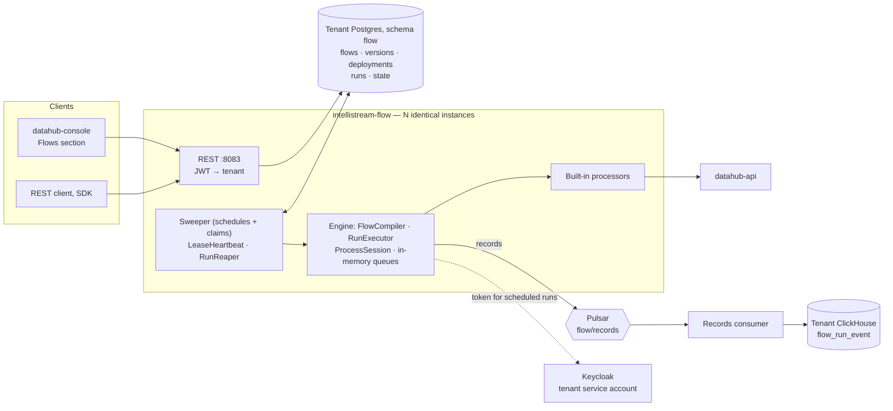

# intellistream-flow — plan

> **Status:** second draft, 2026-10-06 — for discussion in the IntelliStream team before any
> implementation starts. It replaces the first draft of 2026-08-23 (branch
> `docs/intellistream-flow-plan` on the old remote), which tried to design the engine, data
> quality, user-supplied code, change-data-capture and agents in one document. This draft designs
> **the engine only**, and lists the rest as add-ons to be decided one at a time. Decisions are in
> the table below with dates; once work begins, this document is the spec and the table is updated
> in the same PR as any deviation.

## What this is

DataHub will get a new service, **intellistream-flow**, that runs *flows*: small pipelines that
read data from somewhere, transform it, and write it somewhere — on a schedule or when someone
asks. A flow is a configurable tree of *processors*, saved as a versioned definition, and every run
records what happened to the data that went through it.

The design takes its ideas from Apache NiFi (processors wired by named outcomes, each step a small
transaction, a record of everything that happened to each item) but **not its code**. NiFi keeps
its queues on local disk and coordinates nodes with ZooKeeper; we want a service you can run any
number of identical copies of, with all shared state in Postgres. So the engine is ours, and
smaller than NiFi's.

The first version is deliberately plain: a working, reliable processing tree with a handful of
built-in processors. Connectors to external systems, data quality, user-supplied code and agents
are what the roadmap builds on it later. The engine is shaped so that each of them is an *addition* — a new
processor, a new trigger, a new table — not a change to what is already there.

## Scope

**The first version does:**

| Capability | |
|---|---|
| Flow definitions | JSON or YAML, versioned; old versions kept |
| Triggers | Manual and schedule |
| Processing tree | Processors wired by named outcomes; one outcome may feed several processors |
| Built-in processors | Read and write DataHub timeseries; write events; scale, smooth, remove spikes, interpolate, clip, resample, filter by range, threshold alarms, route |
| Preview | Run a flow without writing anything |
| Scale and resilience | Any number of identical instances; a dead instance's run is picked up by another |
| Record of what happened | Per item, per step, per run — for any kind of data |
| Reproducibility | Every run records the flow version, the values it ran with, and the processor versions |
| Interfaces | REST, and a *Flows* section in the console |

**It does not:**

- **Store data.** Flows reads and writes through datahub-api like any other client. Timeseries,
  events and the graph stay where they are; the new tables have no foreign keys to existing ones.
- **Act as a durable queue.** Items between processors live in memory; the source is the durable
  copy (see *Why the queues are in memory*).
- **Process streams statefully.** No windowed joins across streams, no exactly-once guarantees.
- **Run long jobs.** A run lasts at most an hour (15 minutes by default) and must fit in memory on
  one instance; longer work is split into windows.
- **Alert or draw dashboards.** Failures become ordinary DataHub events; dashboards use the
  existing live-update path.
- **Connect to external systems, check data quality, run tenant code, or host agents** — not yet.
  Those are the add-ons listed at the end, each to be designed in its own right. Connectors in
  particular are a goal, not an exclusion: a flow whose first step listens to an OPC UA server
  and writes timeseries is where this is heading (see *Continuous sources and connectors*). Until
  then, data arrives through the ingest API as today, and a flow picks it up from there.

## Decisions so far

| Topic | Decision | Date |
|---|---|---|
| Engine | Our own engine and API; NiFi used as a design reference only. | 2026-08-22 |
| Queues between processors | In memory, inside one run. Durable (Pulsar-backed) connections are a later add-on; the definition format allows for them from the start. | 2026-08-22 |
| Identity for unattended runs | One Keycloak service account per tenant (the `datahub-service-<tenant>` clients that already exist in the dev realm). | 2026-08-22 |
| NiFi licence | Design borrowed freely; an individual class may be ported under its Apache notice with attribution and a "modified" marker (a documented exception to the AGPL-header rule). The NiFi name stays out of product and module names. | 2026-08-23 |
| Tables | New tables only, in a Postgres schema called `flow` inside each tenant's existing database. No foreign keys to existing tables. | 2026-08-23 |
| Batch format | **Arrow** is the engine's in-memory format for record batches. The `--add-opens` JVM flag is part of the service from the start, with a startup check that fails fast if it is missing. | 2026-08-23 |
| Cores | One instance per NUMA node (existing pattern); the run is the unit of parallelism. Defaults stay single-threaded. | 2026-08-23 |
| Words | A step is a **processor** (NiFi's own term). The ontology's `FUNCTION` node type keeps its meaning and is not renamed. Other words: `Flow`, `Connection`, `Run`, `Item`. Console section: **Flows**. | 2026-09-08 |
| Tenant configuration | **All in Vault**, extending the existing `tenant-config/<org>` mechanism with a `flow` section. Flow secrets (HTTP or database credentials) live in the tenant's part of Vault, writable but never readable back. Secrets never go into Postgres, encrypted or not. Feature flags stay operator-owned. | 2026-09-08 |
| APIs | **REST, with server-sent events for watching a run.** MCP tools for agents are an add-on. gRPC is dropped, not deferred: it had no caller, and would have meant a second security path and a code-generation toolchain. Services stay transport-agnostic, so a gRPC facade can be added if a real caller appears. | 2026-09-08, MCP moved to add-ons 2026-10-07 |
| ClickHouse schema ownership | Out of scope for this plan. | 2026-10-05 |
| Scope | **Engine first.** The first version is the processing tree and the machinery to run it reliably (Phases 0–1). Quality, cleaning, custom code, continuous sources and connectors, agents and the designer are add-ons, each decided separately. | 2026-10-06 |
| Item | An item is **content plus attributes**. The content records its kind (`timeseries`, `events`, `records`, `json`, `bytes`). | 2026-10-06 |
| Record of what happened | The **engine** records what happens to items — not each processor — from the session calls every processor makes anyway. The record is the same for any kind of data; what is specific to timeseries (a series and a time window) is an optional reference the engine stores without interpreting. Stored in ClickHouse (see the next row). | 2026-10-06 |
| Where the records live | **ClickHouse**, one append-only table per tenant database, added by a ClickHouse migration. The data the flows read and write is in ClickHouse anyway, so Postgres would add no availability; ClickHouse fits the volume and keeps the records next to the datapoints they describe. Records travel through a Pulsar topic keyed by run, so a run's records arrive in order and a ClickHouse outage only delays them (next row). | 2026-10-07 |
| How records reach ClickHouse | **Through Pulsar.** Instances publish a run's records in batches to `flow/records`, keyed by run id; a consumer in the flow service batches them per tenant and inserts them, acknowledging only after the insert. The same pattern as datapoints, through the stateless consumer. | 2026-10-07 |
| Versioning | Flow versions never change. Every run records the flow version, the actual values it ran with (time window, parameters; for a secret, which one, never its value) and the version of every processor it used. | 2026-10-06 |
| Processor | An interface declaring its properties, its outcomes (relationships), optionally what content it accepts, and what it does. Built-in processors ship with the platform. | 2026-10-06 |
| Type checking between processors | **Deferred.** The first version does not check that connected processors agree on content kind; a mismatch fails at run time and goes to the processor's `failure` outcome. Because items carry their kind and the interface has an optional `accepts` (default: any), checking can be added later without breaking existing processors or flows. | 2026-10-06 |
| Retries | **`maxAttempts` per flow, default 2, naive.** Every failure is retried alike until attempts run out; classifying failures is an add-on. With more than one attempt, a retried run writes its output again; the flow's author decides whether that is acceptable. There is no requirement that sinks be safe to repeat. | 2026-10-06 |
| Branching | One outcome may be connected to several processors. Each receives its own copy: attributes copied, content shared (it is never modified in place). Recorded as a copy, with the original as parent. | 2026-10-06 |
| Processor configuration | NiFi's model: declared properties with types, defaults and allowable values; dynamic properties a processor interprets; dynamic relationships. | 2026-10-07 |
| No expressions in the first version | Built-in processors are **small, well-defined units with fixed parameters** — scale, smooth, remove spikes, interpolate, clip, resample, filter by range, threshold alarm — not a general expression language. More capability comes as more processors. `${…}` substitutes values into properties and does nothing else. An expression language (the first draft chose Spring's SpEL in its restricted mode; CEL is the other candidate) is an add-on. | 2026-10-07 |
| Who may see and change flows | Organization groups **`/flows/read`** and **`/flows/write`**, in the same grammar as the settings grants — and **every flow belongs to one dataset**. Seeing a flow, its runs and its records needs `/flows/read` plus read access to that dataset; creating, changing, deploying or running it needs `/flows/write` plus write access to it. Dataset grants expand down the `BELONGS_TO` hierarchy as they do everywhere else. | 2026-10-07 |
| What a run may touch | Every run acts as the tenant's service account, **confined to its flow's dataset**: the run's DataHub client refuses to read or write anything outside that dataset and its descendants. Processors reach DataHub only through that client. A flow that spans datasets belongs to a common parent. | 2026-10-07 |
| Starting runs | **No dispatch topic.** Instances claim runs straight from Postgres (`SKIP LOCKED`): the sweep claims due and pending runs up to its free capacity, and the instance that receives a manual run starts it itself if it can. Pulsar plays no part in starting runs. | 2026-10-07 |
| Memory | Every run has a **memory cap** on its Arrow data, enforced by its own Arrow allocator; going over fails that run alone. Instances take a run only if its cap fits in what they have free. | 2026-10-07 |
| Failed runs | A run that fails after its last attempt **creates a DataHub event** in the flow's dataset. The console's *Needs attention* list in the Flows section is those events — not a separate store. Dismissing one, or a successful re-run of its window, closes the event. | 2026-10-07 |
| Preview | A preview is a run marked *preview*: sinks report instead of writing, records are kept, it never creates a failure event, and it can run a definition that has not been saved. | 2026-10-07 |
| Retention | **One retention period per tenant** (default 90 days, set by the operator) for everything a run leaves behind: run rows and the records in ClickHouse. Flow versions are kept for as long as the flow exists. | 2026-10-07 |
| Tenant configuration changes | **No push.** Flows relies on the existing five-minute refresh of tenant configuration (`TenantConfigService`), re-reads Vault at once when Keycloak rejects the service account's credentials, and reads flow secrets from Vault at the start of each run. A notify topic for faster propagation stays a platform improvement, not a Flows prerequisite. With dispatch gone too, Pulsar's only job in the first version is carrying records. | 2026-10-07 |
| Where sinks write | Inside the flow's dataset or any dataset connected below it: a flow on `dataset_master_AB`, with `A` and `B` connected beneath it, may write to `dataset_master_AB`, `A` or `B`. A timeseries sink writes to an existing series, or to series it declares, which are **created when the flow is saved**, never during a run. An events sink creates events configured in the sink from its input. | 2026-10-07 |
| A deleted dataset | Its flows are **disabled, not deleted**, and kept for someone with access to all datasets to move to another dataset or delete. | 2026-10-07 |
| Authoring | In the console, a flow is built in a **window showing its processing tree**, with each processor configured through a **form** generated from the processor's catalog entry. The JSON or YAML definition stays available as an alternative view. | 2026-10-07 |
| Run length | Runs are short. Default timeout 15 minutes, tenant maximum 1 hour (set by the operator). Longer work is split into windows. | 2026-10-07 |
| Which run produced a value | The **latest write** to that series and timestamp, by record time — which is also what ClickHouse keeps. Earlier writes are listed as history. A failed attempt that wrote before failing can be the latest writer, and is shown as such. | 2026-10-07 |

## Glossary

- **Flow** — a pipeline definition: processors wired together, stored as JSON or YAML, versioned.
  Editing a flow creates a new version.
- **Processor** — one step in a flow, e.g. "read timeseries", "map values", "write events". It
  declares its configurable properties and its relationships.
- **Relationship** — a named outcome of a processor (`success`, `failure`, `matched`…). A
  connection links one processor's relationship to the next processor, so routing is by outcome.
- **Connection** — an edge from a processor's relationship to another processor.
- **Item** — one piece of data moving through a flow: attributes plus content. Usually a
  *batch* — for timeseries, one series over one time window — not a single value.
- **Run** — one execution of a flow, from trigger to completion, on one instance.
- **Deployment** — a flow version that is switched on, with its trigger and limits. One per flow.
- **Lease** — a row in Postgres saying "instance X owns this run until time T". Instances renew
  their leases while working; if one dies, its leases expire and another instance takes over.

## User stories

1. *As a data engineer, I want to define a flow in JSON or YAML — read `ts_raw`, transform it,
   write `ts_out` — validate it, deploy it on an hourly schedule, and watch its runs in the
   console, so that a pipeline is a versioned definition rather than a cron job on a server.*
2. *As a data engineer, I want to preview a flow — saved or not — on the last hour of data and see
   what it would write without writing it, so that I can build and debug without polluting real
   series or raising alarms.*
3. *As a data engineer, I want to send the same data down two tracks in one flow — one writing a
   transformed series, one raising events — so that I don't have to read it twice.*
4. *As an operator, I want to run as many identical instances of the service as I like, on any
   machines, and have a run that was in progress on a dead instance picked up by another within a
   couple of minutes, so that capacity and resilience are a matter of instance count.*
5. *As a data engineer, I want a run that fails after its last attempt to raise a DataHub event,
   shown as a notification in the Flows section with a button to re-run its window, so that a
   missed hour is noticed and filled rather than discovered weeks later — and so that the same
   failure is visible on dashboards and to anything that watches events.*
6. *As a tenant administrator, I want my flows and runs to be invisible to every other tenant,
   and to switch the feature on per tenant.*
7. *As a tenant administrator, I want each flow to belong to a dataset, so that only people with
   access to that dataset can see or change it, and the flow itself cannot touch data outside it —
   even though its runs are unattended.*
8. *As an analyst, I want to point at a value in a series and find which run produced it, which flow version and settings it
   used, and what each processor did to it, so that a surprising value can be explained.*
9. *As a flow author, I want processor names and properties to stay stable across releases, with
   renames aliased and removals announced, so that my flows keep loading.*

---

## How it works



### A flow and a run

A flow is a graph: processors as nodes, connections as edges, each connection leaving a processor
on one of its relationships. When a run starts, the service builds the graph in memory, gives the
source processors their window, and keeps invoking
processors whose input queue is non-empty until every queue is empty.

Each invocation is a small transaction: the processor takes items, creates or changes items, and
transfers each to a relationship. If it throws, that invocation's changes are discarded and it is
retried a configured number of times. A run's result is what its sinks wrote, summarised from its
records: per sink, the targets and how many points or events. Only when the whole run has finished is the source told "done" — the cursor for the next
scheduled read is advanced.

**Every run covers an explicit time window** `[from, to)`. A scheduled run takes it from the
schedule; a manual run supplies it or defaults to the last interval. Nothing reads "whatever is new
since last time" without saying which window that was. This is what makes a run reproducible, and
what a later backfill ("re-run March") is built from: many runs with given windows.

### Items

An item is attributes (a small string map) plus content. The content knows its kind:

| Kind | What it holds |
|---|---|
| `timeseries` | One series over one window: Arrow batch of `(timestamp, value)` |
| `events` | A batch of DataHub events |
| `records` | Rows with an Arrow schema |
| `json` | A JSON document |
| `bytes` | Anything else, with a media type |

Content is never modified in place: a processor that changes it produces new content. That makes
copying an item cheap (see *Branching*) and is what lets the engine record a content hash before
and after each step. Large content spills to a local temp file.

### Branching

A relationship may be connected to any number of processors. Each connection gets its own copy of
the item: the attributes are copied, the content is shared. A change one branch makes to its
attributes is invisible to the other. The engine records the copy, with the original as parent.

Several connections may also lead *into* one processor; it receives items from all of them on one
queue. There is no joining by key — matching items from two branches is a processor's job, and not
one the first version ships.

The validator rejects cycles.

### What the engine records

The engine records every action a processor takes through its session — created an item, read it
from somewhere, sent it somewhere, changed its attributes or content, split it, copied it, routed
it to a relationship, dropped it. One record per action:

> run · attempt · processor · action · item id · parent item ids · relationship · content kind ·
> size · hash · changed attributes · transit URI · duration

The **transit URI** says where an item came from or went to, as in NiFi: set by a processor that
reads from or writes to something outside the flow, absent otherwise. It is the only field for
this. For DataHub's own data the URI follows a fixed form the platform can parse:

| Data | Transit URI |
|---|---|
| Datapoints of a series over a window | `datahub://timeseries/{externalId}?from={instant}&to={instant}` |
| One event | `datahub://events/{externalId}` |
| A batch of events | `datahub://events?type={type}&subType={subType}&from={instant}&to={instant}` |

External ids are percent-encoded; the tenant is implicit (the records are in the tenant's own
database). Other systems use their own URIs — `opc.tcp://plc-07:4840/ns=2;s=Line1.Temp`,
`https://api.example.com/v1/readings`, `jdbc:postgresql://db01:5432/sales` — and each processor
documents its form. Credentials and query-string secrets are never put in a URI.

**The content hash** is not a way to find data — the URI is. It records *what the data was* when
the run touched it, so that it can be checked later:

- **Has the input changed since?** Re-read the URI, hash it, compare. A mismatch means late data
  or an overwrite since the run — the question an audit asks of a report.
- **Did two runs see the same data?** Equal hashes for the same URI across a retry or a re-run.
- **Did a step change the content?** Hash in versus hash out.

It cannot bring back data that has since changed: ClickHouse keeps the latest value per series and
timestamp, and items between processors are not stored at all. Keeping copies of content is an
add-on (under *Lineage and export*). For re-reads to give the same hash, it is computed over a canonical
form — rows sorted by timestamp, a fixed encoding per column type — not over Arrow's in-memory
bytes. It is xxHash (already used by the platform), which detects change; it is not a
cryptographic seal against deliberate tampering.

Processors do not report these themselves. Because the engine derives them from the session calls
every processor makes anyway, a new processor is recorded correctly without doing anything.

The records end up in a ClickHouse table in the tenant's database (`flow_run_event`, Appendix A),
append-only and never updated. They get there through Pulsar:

1. **Publish during the run.** The engine collects a run's records and publishes them in batches —
   every 1,000 records or 5 seconds, whichever comes first, and a final batch when the run ends —
   to `persistent://{internal}/flow/records`. Each message is one batch for one run and attempt,
   with a sequence number, and its **key is the run id**, so all of a run's batches go to the same
   partition in the order they were sent.
2. **Before the run is marked done,** the instance waits for Pulsar to acknowledge the final batch.
   Once acknowledged, the records are durable: a run is never `SUCCEEDED` with records still only in
   memory. If Pulsar does not acknowledge within the run's remaining time, the run fails.
3. **Consume and insert.** Every flow instance also runs a consumer on that topic (subscription
   `intellistream-flow-records`, **Key_Shared**, so one run's batches are always handled by one
   consumer, in order). It receives in batches (about 500 ms or a few MB), groups by tenant, inserts
   into each tenant's ClickHouse, and acknowledges only after the insert succeeded. A failing
   tenant's messages are negatively acknowledged on their own — one tenant's ClickHouse being down
   never holds up another's records. After repeated failures a message goes to a dead-letter topic.
4. **No duplicates on redelivery.** Each insert carries an `insert_deduplication_token` derived from
   the run, attempt and sequence number, so a batch inserted but not yet acknowledged when a
   consumer died is not inserted twice.

Order is kept on the way in, and does not have to be relied on afterwards: records are read back
by run, attempt and sequence number, so a batch that is redelivered late lands in the right place.

What this gives: a run's records arrive in order; an attempt whose instance dies leaves the batches
it had published, marked with its attempt number, so the console shows what each attempt did; and
a ClickHouse outage delays records (they wait on the topic) rather than failing runs — though a run
whose own sinks write to ClickHouse still fails, as it would anyway. With at most a handful of
processors per flow, a run produces a few messages, not thousands. Flows should keep a batch as one
item; a per-run cap with a *truncated* marker bounds the rest.

The topic's backlog is bounded (a backlog quota and retention), and consumer lag is a metric — with
no tenant on it (CONSTRAINTS #5) — because a stalled consumer is otherwise invisible until the
quota is hit.

### Versioning and reproducibility

A flow version is immutable once saved. A run records:

- the flow version;
- the values it ran with — the time window, every parameter as resolved; for a secret, which
  secret, never its value;
- the version of every processor in the flow (built-in processors change with platform releases).

Together these answer "why did the same flow give a different result last month?" without
guessing.

### Why the queues are in memory

NiFi writes every queue to local disk because it acknowledges the source the moment data arrives
and then promises never to lose it. We hold the acknowledgement until the run completes instead,
so the *source* stays the durable copy: a schedule's cursor is only advanced at the end of a run,
and DataHub's timeseries can be read again. Every run starts from a source that can be read again,
so there is nothing for the flow service to keep: a run cannot be handed data directly.

The trade-off: a run has to fit in memory; one slow step slows the whole run rather than building
a backlog; all steps of a run execute on the same instance. For a connection that needs a real
backlog — a flaky sink, a step that should scale on its own — the definition format accepts
`durable: true` from the start, and a later add-on implements it by splitting the flow at that
point with a Pulsar topic in between. Until then the flag is rejected by the validator.

### How many instances share the work

Every instance is identical and runs the same loops. All coordination is rows in Postgres; nothing
else is involved.

1. **Sweep.** Every ~10 seconds each instance, for each tenant, in one transaction:
   - creates a *pending* run for every schedule that is due, and moves the schedule forward —
     locking the schedule rows it picks (`SELECT … FOR UPDATE SKIP LOCKED`), so no two instances
     create the same run;
   - claims pending runs, oldest first, up to the capacity it has free (`SKIP LOCKED` again, and at
     most a few per sweep, so the first instance to sweep does not take everything): sets them
     `RUNNING`, itself as owner, with a lease.
2. **Manual runs.** The instance that receives the request creates the run and, if it has room,
   claims and starts it at once. If it is full, the run stays pending and the next sweep on any
   instance picks it up — within about ten seconds.
3. **Execute.** While running, the instance renews its lease every 15 seconds, with an update that
   only succeeds if it is still the owner. When the run finishes, one transaction writes the
   result, the saved processor state and the final status — again only if this instance still owns
   the run. Only one instance ever executes a given attempt.
4. **Reaper.** Every 30 seconds each instance looks for runs whose lease expired. Those go back to
   pending for another attempt (after a back-off), or are marked failed when the flow's
   `maxAttempts` is used up.

A scheduled run starts within about ten seconds of being due; a manual run at once when its
instance has room.

### Memory

A run's batches live in Arrow memory, which sits outside the Java heap and is handed out by
*allocators* that can be nested with limits. Each run gets its **own child allocator, capped**:

- The cap comes from the flow's `execution.memory` (default 512 MB), up to a tenant maximum the
  operator sets (default 4 GB).
- Going over the cap throws an ordinary exception in that run only. The run fails with
  `MEMORY_LIMIT` and every other run on the instance carries on.
- Content that is not Arrow (`json`, `bytes`) counts against the same cap when it is held in
  memory, and spills to a temp file when large.
- An instance claims a run only if the run's cap fits in its own Arrow budget (configured per
  instance) minus the caps of the runs it already has. Otherwise it leaves the run for an instance
  with room.

What the cap cannot cover is the Java heap itself (attributes, processor internals). As a
backstop, instances run with `-XX:+ExitOnOutOfMemoryError`: an instance that runs out of heap
exits cleanly instead of limping on, and its runs are picked up as for any dead instance.

### Failed runs

A run that ends `FAILED` after its last attempt — an error, a timeout, a memory cap, or a lost
lease — **creates a DataHub event** in the flow's dataset:

| Field | Value |
|---|---|
| `type` / `subType` | `flow` / `run-failed` |
| `externalId` | `flow:{flowExternalId}:{windowStart}` — one per flow and window |
| `startTime`, `endTime` | The run's window |
| `status` | `open` |
| metadata | flow, flow version, run id, attempts, the error |

The console's **Needs attention** list in the Flows section *is* these events — open `run-failed`
events in datasets the user can read, grouped per flow, with a count on the section's entry. There
is no separate notification store. Each one offers:

- **Re-run** — a new run over the same window, with the flow's currently deployed version. When it
  succeeds, the event is closed (`status: resolved`).
- **Dismiss** — closes the event (`status: dismissed`), recording who and when.

Because the external id is per flow and window, a re-run that fails again adds to the same event's
lifecycle rather than creating a second one — several events sharing an external id is how DataHub
records an event's lifecycle. Being an ordinary event, the failure also appears on dashboards and to anything
that consumes events.

The event is written by the instance that finishes the run, or by the reaper for a lost lease, as
the tenant's service account. If datahub-api cannot take it at that moment, the run is marked as
owing an event and the next sweep tries again, so a failure is never silently unreported.

A failed scheduled run is how a window gets missed, so this is also how a missed window gets
noticed and filled. Previews never create these events.

### Preview

A preview is a run marked *preview*. It runs the flow exactly as a real run would — same engine,
same dataset limit, same records — except that sinks report what they would write instead of
writing it. It can run a saved version or a definition that has not been saved (the way to try a
flow before keeping it). A preview never creates a failure event, never advances a schedule, and
is shown apart from real runs in the console. Its window defaults to the last hour.

### How changes reach the instances

Nothing is pushed to instances when a flow changes; Postgres is read at the moments that matter,
and versions never change.

- **Editing a flow** saves a new version. Nothing running is affected.
- **Deploying a version** updates the deployment row. The next run created — by the next sweep, or
  the next manual start — uses it. A run in progress finishes on the version it started with.
- **Changing or disabling a schedule** updates the schedule row. The next sweep, within about ten
  seconds, sees it; a disabled deployment gets no new runs. Cancelling the runs in progress is a
  separate, explicit action.
- **Tenant configuration** — a tenant added or removed, the `flow` feature switched, operator
  limits changed — reaches every instance at the next five-minute refresh. Rotated service-account
  credentials are picked up at once: a rejected token request triggers a fresh read from Vault.
  Flow secrets are read from Vault when a run starts, so they are never stale.
- **Caching** is safe because a flow version is immutable: an instance compiles version 7 once and
  keeps it, and never needs telling that it changed, because it cannot.

### Retries

A flow sets `maxAttempts` (default 2). The trade-off is the author's:

- **`maxAttempts: 2`** (the default) — a run that fails, or whose instance dies, is run once more
  from the start, on any instance. If that fails too, it ends as `FAILED` and raises its event.
- **`maxAttempts: 1`** — for a flow whose output must not be written twice: no retry; a failure
  goes straight to its event.
- **More than 1** — the whole run is retried from the start, so whatever it wrote before failing
  is written again. For datapoints that is harmless: a datapoint with the same series and
  timestamp replaces the earlier one. For other sinks it depends on the sink, and the processor's
  documentation says so.

A failed attempt's partial output stays visible until a retry overwrites it, or for good if there
is no retry. The design accepts that rather than staging writes.

Separately from the run, a single processor invocation that throws can be retried within the run
(`retry` on the processor in the definition) — useful for a sink that times out now and then.

**Retries are deliberately naive in the first version:** every failure is retried the same way,
whatever caused it, until the attempts run out. A bad property or a 403 is retried as faithfully
as a timeout, which wastes the attempts but is harmless. Telling failures that are worth retrying
from those that are not is an add-on (*Failure classes*).

### What happens when something dies

The principle: **nothing that matters lives only on the machine that died.** The source keeps the
input until the run has finished, and the run's state is a lease in Postgres that any instance can
take over.

| What dies | How it is noticed | What happens |
|---|---|---|
| An instance, mid-run | Its lease stops being renewed (every 15 s; expires after 60 s) | The reaper re-queues the run (attempt + 1) or marks it `FAILED (LEASE_LOST)`; another instance runs it from the start. Within about 90 s. |
| Postgres, for longer than a lease | Heartbeats fail | **Self-fencing:** an instance that cannot renew its lease by the time it expires treats itself as fenced and aborts the run, so there is never a second live copy when Postgres returns. No new claims; sweeps pause. |
| ClickHouse | Inserts fail | Records wait on the Pulsar topic and arrive when ClickHouse returns. Runs whose sinks read or write ClickHouse fail, as on any failing sink, and are retried or shown under *Needs attention*. |
| Pulsar | Publishing fails | Runs in progress cannot confirm their records and fail at the end; new runs fail the same way until Pulsar returns. Records already published are safe on the topic. |
| A whole host | Leases expire | As for an instance. |

### What this costs Postgres

Nothing on the data path goes through Postgres: items move in memory. The load is control traffic
— small, single-row, indexed statements, spread over the tenants' own databases:

| Source | Rate | At 100 instances · 50 tenants · ~1,000 runs in flight |
|---|---|---|
| Schedule sweep | every 10 s per instance per tenant | ~500 mostly-empty queries/s |
| Reaper | every 30 s per instance per tenant | ~170/s |
| Lease heartbeat | every 15 s per running run | ~70 single-row updates/s |
| The run itself | ~5 statements per run | ~500/s at an extreme 100 runs/s |

Roughly 1,000–1,500 statements/s across the cluster at full tilt — tens per second per tenant
database. Three details matter more than the totals:

- **One transaction per tenant per tick**, never one per row: there is no application-side
  connection pool by design (pgbouncer), so connection churn is the real per-statement cost.
- **Heartbeats must be HOT updates:** no index on `run.lease_expires_at`. The reaper uses a partial
  index on `status = 'RUNNING'` and filters expiry in memory.
- **Bloat comes from churn:** `run` rows are updated several times and deleted by retention, so
  retention deletes in batches and `run` gets a lower autovacuum scale factor.

The sweep and reaper are the only parts that grow with **instances × tenants** rather than with
work. At several hundred tenants, tenants are sharded across instances.

### Retention

Everything a run leaves behind expires together, after **one retention period per tenant**
(default 90 days, set by the operator):

- run rows, deleted in batches by datahub-cleanup;
- the records in ClickHouse, by the table's TTL, which is changed when the period is changed.

So a record never outlives its run, and a run never shows records that have already expired. Flow
versions are kept for as long as the flow exists, because runs and events point at them. Failure
events are DataHub events and follow the tenant's event retention.

### Tenants

Each tenant already has its own Postgres database and Pulsar tenant. The new tables sit in a `flow`
schema in the tenant's database (Flyway, from **V45**) and reference nothing outside it — a flow
refers to a dataset by its external id and calls datahub-api over HTTP. Every run thread sets
`TenantContext`, as the API does. Each tenant has a concurrency budget. A tenant gets the feature
through a `flow` flag next to `policy`, `streaming` and `chat` in the operator-owned tenant
configuration.

### Who a run acts as, and what it may touch

Every flow belongs to **one dataset**, set when it is created. That dataset decides who can see the
flow and what the flow can reach.

**People.** Seeing a flow, its runs and its records needs `/flows/read` and read access to the
flow's dataset. Creating, changing, deploying, previewing or starting it needs `/flows/write` and
write access to the dataset. Grants on a parent dataset cover its descendants, as everywhere else.
A user without access to the dataset does not see the flow at all — lists are filtered, a direct
request answers 404.

**Runs.** Every run — scheduled or manual — calls datahub-api as the tenant's **service account**:
one per tenant, shared by all of that tenant's flows and runs, never one per flow or per run. Each
instance holds one token per tenant (client credentials, through the SDK's existing
`TokenProvider`), reuses it across runs and renews it before it expires. Its credentials are in the
tenant's `flow` section in Vault.

The service account can usually reach more than any one flow should, so the run's DataHub client
**confines it to the flow's dataset**: a series, event or dataset outside that dataset and its
descendants is refused before any call is made, and a sink that creates a series or event must put
it inside. Processors cannot get around this, because the client in their context is their only
way to DataHub. A flow that needs data from two datasets belongs to a parent of both: a flow on
`dataset_master_AB`, with `A` and `B` connected beneath it, may read and write `dataset_master_AB`,
`A` and `B`, and nothing else.

**When the dataset is deleted,** the flow is disabled, not deleted. The sweep checks a deployment's
dataset before creating a run; if it is gone, the deployment is switched off with the reason
`DATASET_DELETED` and no run is created. The flow, its versions and its history stay. With its
dataset gone, nobody can see it through dataset grants, so it is listed for users with access to
all datasets (`/datasets/*/write`), who can move it to another dataset — which takes write access to
that dataset — or delete it.

This holds because every processor in the first version is platform code. Tenant-supplied code
(an add-on) would need the same limit enforced by datahub-api itself, not by the flow service.

---

## The processor interface

Every processor — built-in now, tenant-supplied later — implements one interface. A sketch:

```java
public interface Processor {

    /** Name, version, properties, relationships, and (optionally) what content it accepts. */
    ProcessorDescriptor describe();

    /** Problems with a combination of property values that no single property can see. */
    default List<String> validate(PropertyValues properties) { return List.of(); }

    /** Take items from the session, produce or change items, transfer each to a relationship. */
    void onTrigger(ProcessContext context, ProcessSession session) throws ProcessException;
}
```

- **`ProcessorDescriptor`** — a stable name (`datahub.timeseries.source`), a version, the
  properties, the dynamic properties if it takes any, the relationships (fixed, or one per dynamic
  property), and `accepts`, which defaults to *any* and is not checked in the first version.
  Published in the catalog as JSON schema, which is what the console's forms and an agent read.
- **`ProcessContext`** — resolved property values; the run's window and
  parameters; secrets by name; saved state (a small per-processor value that survives between
  runs, such as a cursor); a DataHub client for the run; whether this is a preview; whether the run
  has been cancelled or its lease lost; and a log that ends up on the run's page.
- **`ProcessSession`** — `get`, `create`, `putAttribute`, `write`, `transfer(item, relationship)`,
  `remove`. Each call is what the engine records. A processor has no other way to touch items.

The interface lives in its own module under Apache-2.0 (`intellistream-flow-api`), for the same
reason `datahub-api-model` is: a partner's processor, or later a tenant's, must not be forced
under the AGPL. The engine and service are AGPL.

Processor names and properties are part of the contract: a rename keeps the old name as an alias,
and a removal is announced at least one release in advance.

## Configuring processors

Processors are configured the way NiFi's are: each declares its properties, and a flow sets values
for them. There is no code in a flow definition: a processor does one well-defined thing, and what
it does is chosen by its parameters. More capability comes from more processors, not from a more
powerful configuration language.

### Properties

Every property declares:

| Field | |
|---|---|
| `name` | Stable key used in the flow definition (`target`) |
| `displayName`, `description` | For the console's form and the catalog |
| `type` | `string`, `number`, `boolean`, `duration`, `instant`, `list`, `enum`, `secret` |
| `required`, `default` | A required property without a default must be set |
| `allowableValues` | For `enum`: the values, each with a description |
| `references` | Whether `${…}` references are allowed in the value (below) |
| `sensitive` | Never shown or logged; must be a `secret` reference |

**Dynamic properties** are user-named properties a processor interprets, as in NiFi. The processor
declares what the key and the value mean — for `route.on.attribute`, the key is a relationship
name and the value the attribute value that selects it. In the catalog's JSON schema they are
`additionalProperties`, with that description. A processor may give each dynamic property its own
relationship.

**Validation** happens when a flow is saved: types, required properties, allowable values, that
secrets and parameters exist, and the processor's own `validate` for combinations ("`name` is only
used with `create`", "set `min`, `max` or both").

### References

`${…}` substitutes a value into a property: a flow parameter (`${parameters.limit}`), the run's
window (`${run.window.start}`, `${run.window.end}`), or an attribute of the item being handled
(`${timeseries.externalId}`), or a summary of a `timeseries` item (`${item.last}`, `${item.lastTime}`,
`${item.min}`, `${item.max}`, `${item.mean}`, `${item.count}`). Only substitution — no operators, no functions. Run-level references
are resolved once per run, attribute references once per item. A substituted value that does not
fit the property's type fails the item, not the save.

### Item shapes

The processors below agree on two shapes:

- **`timeseries`** — one series over one window: columns `timestamp`, `value`; attributes
  `timeseries.externalId`, `window.start`, `window.end`.
- **`events`** — one row per event: columns `startTime`, `endTime` (may be null), `value` (may be
  null); the attributes of the item it came from.

### Ending a flow

Every outcome of a processor must either be connected or be listed in the processor's `terminate`
list, which ends items there (NiFi's *auto-terminate*). Nothing disappears because someone forgot a
connection: the validator rejects an outcome that is neither.

**Sinks are terminating processors**: they write to DataHub and are where a flow normally ends.
Their `success` outcome terminates by default — connect it only to carry on after writing. Their
`failure` outcome is the opposite: left unconnected, a failed write fails the run.

### Built-in processors in the first version

**`datahub.timeseries.source`** — reads series over a window. One `timeseries` item per series.

| Property | Type | Default | |
|---|---|---|---|
| `timeseries` | list | — (required) | External ids of the series |
| `from` | instant, references | `${run.window.start}` | |
| `to` | instant, references | `${run.window.end}` | |
| `lookback` | duration | `PT0S` | Also read this much before `from`, as history for smoothing and spike removal |
| `maxPointsPerItem` | number | 100,000 | A longer series is split into several items |
| `onMissing` | enum | `fail` | `fail` the run, or `skip` the series |

Relationships: `success`. With a `lookback`, the item holds points from before `window.start`;
processors that need history use them, and the sink writes only points from `window.start` on.

**`datahub.timeseries.sink`** — writes a `timeseries` item's datapoints to a series, either one
that already exists or one the sink declares. The item passes on unchanged after it is written.

| Property | Type | Default | |
|---|---|---|---|
| `target` | string, references | `${timeseries.externalId}` | Series to write to, e.g. `${timeseries.externalId}_f` |
| `create` | boolean | `false` | `false`: every target must already exist. `true`: targets that do not exist are created **when the flow is saved** |
| `name`, `unit`, `description` | string, references | — | For created series |
| `dataSet` | enum | the flow's dataset | Dataset of created series: the flow's dataset or one connected below it |

With `create`, every target the sink can produce must be known when the flow is saved — a fixed
external id, or a reference over the source's fixed list of series — so that the person saving the
flow creates them, with their own access, before any run. A run never creates a series: a target
that is missing at run time fails the item. Only points in `[window.start, window.end)` are
written; history read through `lookback` is not.

Relationships: `success`, `failure`. In preview, reports the target and the number of points
instead of writing.

**`datahub.events.sink`** — creates one DataHub event per row of an `events` item: type, subtype,
dataset, external id, description and metadata as configured here, with `startTime`, `endTime` and
`value` from the row. Rows with the same external id add to that event's lifecycle.

| Property | Type | Default | |
|---|---|---|---|
| `type` | string, references | — (required) | |
| `subType` | string, references | — | |
| `externalId` | string, references | — | If unset, the platform assigns one |
| `dataSet` | enum | the flow's dataset | The flow's dataset or one connected below it |
| `description` | string, references | — | |
| *dynamic* | string, references | | Key: a metadata key on the event. Value: its value, e.g. `${timeseries.externalId}`. |

Relationships: `success`, `failure`. In preview, reports the events instead of creating them.

Both sinks only write inside the flow's dataset (see *Who a run acts as*).

**`timeseries.scale`** — `value × factor + offset` for every point. Covers unit conversion, adding
or subtracting a constant, multiplying and dividing.

| Property | Type | Default |
|---|---|---|
| `factor` | number, references | 1 |
| `offset` | number, references | 0 |

Relationships: `success`.

**`timeseries.smooth`** — replaces every point with a smoothed value computed over a time window
around it (trailing, so a point never depends on later ones). Windows are by time, not by point
count, so irregular sampling is handled.

| Property | Type | Default | |
|---|---|---|---|
| `method` | enum | `median` | `median`: rolling median — removes short spikes, keeps steps sharp. `mean`: rolling mean. `exponential`: exponential smoothing with time constant `window`, weighted by the gap between points |
| `window` | duration | — (required) | |

Relationships: `success`. Points earlier than one `window` after the first available point have
too little history and are passed through unchanged; reading `lookback` ≥ `window` avoids that
for the run's own window.

**`timeseries.despike`** — finds spikes and removes or replaces them, leaving every other point
untouched (a Hampel filter). A point is a spike when it is more than `threshold` × the median
absolute deviation away from the rolling median of the `window` before it.

| Property | Type | Default | |
|---|---|---|---|
| `window` | duration | — (required) | |
| `threshold` | number | 3 | In median absolute deviations |
| `action` | enum | `remove` | `remove` the point, or `replace` it with the rolling median |

Relationships: `success`; `spikes` (optional to connect: the spikes found, as a `timeseries`
item, for alarming or inspection). Sets the attribute `despike.count`.

**`timeseries.interpolate`** — fills gaps between known points. A gap is a stretch longer than
`interval` with no points; it is filled with points every `interval`. Only gaps between two known
points are filled — never before the first or after the last, so nothing is extrapolated (a
`lookback` lets a gap at the start of the window be filled).

| Property | Type | Default | |
|---|---|---|---|
| `interval` | duration | — (required) | The series' expected sampling interval |
| `method` | enum | `linear` | `linear` between the two neighbours, or `previous` (hold the last value) |
| `maxGap` | duration | — | Leave gaps longer than this unfilled; unset fills every gap |

Relationships: `success`. Sets the attribute `interpolate.count`.

**`timeseries.clip`** — limits values to a range: a value below `min` becomes `min`, one above
`max` becomes `max`. Unlike `timeseries.filter.range`, every point is kept.

| Property | Type | Default | |
|---|---|---|---|
| `min` | number, references | — | At least one of `min`, `max` |
| `max` | number, references | — | |

Relationships: `success`. Sets the attribute `clip.count`.

**`timeseries.resample`** — puts a series on a regular interval: the points in each bucket of
length `interval` are combined into one point, timestamped at the start of the bucket. Buckets are
aligned to whole intervals since the epoch (a `PT1H` bucket starts on the hour), so the same
input gives the same buckets in every run. A bucket with no points produces no point; follow with
`timeseries.interpolate` to fill it.

| Property | Type | Default | |
|---|---|---|---|
| `interval` | duration | — (required) | |
| `aggregate` | enum | `mean` | `mean`, `min`, `max`, `first`, `last`, `sum`, `count` |

Relationships: `success`.

These cleaning processors do one thing each and are not applied in any built-in order: the flow's
wiring is the order. A typical chain is despike → resample → interpolate → smooth.

**`timeseries.filter.range`** — splits a series' points by whether they lie in a range.

| Property | Type | Default | |
|---|---|---|---|
| `min` | number, references | — | At least one of `min`, `max` |
| `max` | number, references | — | |
| `inclusive` | boolean | `true` | Whether the bounds themselves are in range |

Relationships: `inRange`, `outOfRange`. Both keep the item's attributes; an empty side is not
emitted.

**`timeseries.threshold`** — finds the periods a series is above (or below) a threshold, and
produces them as an `events` item: one row per period, with `startTime`, `endTime` (null if still
ongoing at the end of the window) and `value` (the peak, or the trough for `below`).

| Property | Type | Default | |
|---|---|---|---|
| `threshold` | number, references | — (required) | |
| `direction` | enum | `above` | `above` or `below` |
| `minDuration` | duration | `PT0S` | Ignore periods shorter than this |

Relationships: `alarms` (emitted only when there is at least one period), `success` (the input
series, unchanged).

**`route.on.attribute`** — routes whole items by the value of one attribute.

| Property | Type | Default | |
|---|---|---|---|
| `attribute` | string | — (required) | The attribute to look at |
| *dynamic* | string | | Key: a relationship name. Value: the attribute value that selects it. |

Relationships: one per dynamic property, and `unmatched`.

### What the first version's processors cannot do

**Combine several inputs.** A processor has one input queue: items from all its incoming
connections arrive on it, it cannot tell which connection an item came from, and it is not told
when no more items are coming. So "add series A to series B" or "attach the series' values to each
event" cannot be built yet. See *Multiple inputs* under *Add-ons*.

## A flow definition

```jsonc
{
  "schemaVersion": 1,
  "externalId": "temp_hourly",
  "dataSet": "ds_demo",                                            // the flow's dataset: access and reach
  "name": "Hourly temperature: Fahrenheit series and over-limit alarms",
  "parameters": {
    "window": { "type": "duration", "default": "PT1H" },
    "limit":  { "type": "number",   "default": 140 }
  },
  "processors": [
    { "id": "src",  "type": "datahub.timeseries.source",
      "properties": { "timeseries": ["ts_out_temp"] } },            // window: the run's, by default
    { "id": "f",    "type": "timeseries.scale",
      "properties": { "factor": 1.8, "offset": 32 } },
    { "id": "out",  "type": "datahub.timeseries.sink",
      "properties": { "target": "${timeseries.externalId}_f", "create": true,
                      "name": "Outdoor temperature (°F)", "unit": "°F" },
      "retry": { "maxAttempts": 3, "backoff": "PT5S" } },
    { "id": "over", "type": "timeseries.threshold",
      "properties": { "threshold": "${parameters.limit}", "minDuration": "PT5M" },
      "terminate": ["success"] },                                    // only the alarms go on
    { "id": "ev",   "type": "datahub.events.sink",
      "properties": { "type": "temperature", "subType": "over-limit",
                      "series": "${timeseries.externalId}" } }     // dynamic: metadata key
  ],
  "connections": [
    { "from": "src",  "relationship": "success", "to": "f" },
    { "from": "f",    "relationship": "success", "to": "out" },   // the same outcome feeds two
    { "from": "f",    "relationship": "success", "to": "over" },  //   processors: each gets a copy
    { "from": "over", "relationship": "alarms",  "to": "ev" }
  ],
  "trigger":   { "type": "schedule", "cron": "0 0 * * * *", "timezone": "Europe/Oslo",
                 "window": "${parameters.window}" },
  "execution": { "maxConcurrentRuns": 1, "maxAttempts": 2, "timeout": "PT15M", "memory": "512MB" }
}
```

---

## What is built when

### Before Phase 0

Two small pieces of the tenant configuration work that has already shipped:

- a `flow` section in `tenant-config/<org>`, for the service-account credentials and flow secrets;
- the settings-grant handling (`SettingsGrants`, currently in datahub-api, and `SettingsScopes`)
  made usable outside datahub-api, so the flow service can resolve the same grants.

### Phase 0 — Foundations

The modules, the build, security and tenant plumbing, the `flow` schema, the deployment files.
Nothing user-visible yet.

- Modules `intellistream-flow-api` (Apache-2.0, the processor interface) and `intellistream-flow`
  (AGPL, engine and service), following the existing conventions; AGENTS.md's licensing section
  lists the new Apache module.
- JWT → organization → `TenantContext`; tenants without the `flow` flag get 404, tenants not yet
  provisioned 503.
- Flyway V45: the `flow` schema (Appendix A).
- A ClickHouse migration: the `flow_run_event` table in each tenant's ClickHouse database.
- The `flow/records` topic (partitioned, with a backlog quota) in the dev stack's Pulsar setup, and
  the records consumer.
- The compose service, the systemd unit, Keycloak groups.
- Metrics follow CONSTRAINTS #5: no tenant or deployment on any Prometheus metric. Management port
  9084, off by default, the same `@Order(1)` chain as the other services.

**Done when** the service boots in the compose stack, answers `GET /catalog/processors` with a
valid JWT, and the `flow` schema and the `flow_run_event` table exist in the `foo` and `bar` tenant databases.

### Phase 1 — The processing tree

Define a flow, deploy it with a manual or schedule trigger, have it run on any instance, read and
write DataHub timeseries and events, see the run and what happened in the console. This is the phase that proves the coordination model.

Contents: flow create/read/update and versions; validation (structure, properties, references,
cycles — not content kinds); the engine; branching; the sweep, claim, lease and reaper loops;
`maxAttempts` and per-processor retry; the run record (version, resolved values, processor
versions); the engine's record of what happened; the twelve built-in processors; outcomes connected or terminated; preview; service account tokens and the confinement of each run to its flow's dataset; `/flows/read|write` with dataset access on every endpoint; failure events and the *Needs attention* list; the value lookup; one retention period across runs and records; the console's Flows section — list; the editor (the processing tree with a form per processor, generated from the catalog, and the JSON/YAML view); deploy; runs; a run's steps and records — calling the flow service directly from the browser, as the Analyze tab calls datahub-analysis (CONSTRAINTS, frontend #2); creating declared series on save; disabling flows whose dataset is deleted.

**Done when:** the example flow above runs hourly on a two-instance stack; killing the instance
running it mid-run gets it re-run on the other within two minutes, and a run that fails twice raises a `run-failed` event; preview writes nothing; the event shows under *Needs attention* and re-running the window closes it; a preview of an unsaved definition writes nothing and raises nothing; a run over its memory cap fails without affecting others on the instance; a flow whose source names a series outside its dataset is refused; and for any value it wrote, the console shows which run, flow
version, parameter values and processor versions produced it.

## What stays open for the add-ons

The first version is shaped so that each add-on is an addition. These are the points it must not
close off:

1. **Items are content plus attributes.** A quality class, a confidence or an origin becomes an
   attribute; no processor changes.
2. **The engine records what happened**, so a new processor — including tenant-supplied code — is
   recorded without doing anything.
3. **Every run has an explicit window**, so backfill and re-evaluating late data are many runs with
   given windows.
4. **Flow versions are immutable and runs record what they ran with**, so later audit and lineage
   have something to point at.
5. **The processor interface is the only extension point.** A quality checkpoint, a cleaning step
   and a tenant's Python step are each just another processor.
6. **The definition format has a version** and an agreed rule for fields it does not know, so
   `durable` and later fields can be added.
7. **Items carry their content kind and processors may declare `accepts`**, so type checking
   between processors can be switched on without breaking anything.
8. **A source can be long-lived.** The first version's sources read once per run, but nothing in
   the engine may assume that: a run must be startable with items handed to it by a listener, and
   the definition's trigger types must be open to a `listener` trigger. That is what connectors
   (an OPC UA server, for instance) are built on.

## Add-ons — not designed here

Each of these gets its own design and decision before work starts. The first draft has a fuller
treatment of most of them and is a starting point, not a decision.

- **Data quality and the audit.** Checkpoints that measure completeness, validity, timeliness and
  consistency and classify batches as good, degraded or bad; the audit that answers "was this
  report built on good data for this period?"; sensor calibration tables in the graph.
- **Multiple inputs.** Processors that combine items — add two series, compare them, attach a
  series' values to events. Three ways, from simplest:
  1. *Combine at the source:* read several series aggregated to a common interval (the API already
     serves aggregated series) as one item with a column per series, and give processors two
     columns to work on. No engine change.
  2. *Look up from inside the processor:* a processor handling events reads the series it needs
     through its DataHub client. No engine change.
  3. *Named inputs:* a connection names the input it feeds (`"input": "left"`, default `in`), the
     session reads per input, and a processor with more than one input is invoked only once every
     processor upstream of it has finished — well defined, because a run is finite. Pairing items
     (by series, by window) is the processor's job. An addition to the interface and the format,
     not a change.
- **Updating resources.** A `datahub.resource.update` sink that puts a value, an alarm state or a
  computed figure on a node in the graph (metadata and description; not labels), confined to the
  flow's dataset like the other sinks.
- **Expressions.** A general expression language for computed columns and conditions
  (`record.map`, `filter.records`, routing on conditions). The first draft chose Spring's SpEL in
  its restricted `SimpleEvaluationContext`; CEL is the alternative, type-checked when a flow is
  saved and available for Go and Python too.
- **Type checking between processors.** Switch on `accepts`, and check record schemas where they
  are known.
- **Lineage and export.** Lineage between datasets in the knowledge graph; OpenLineage export; keeping copies of a
  step's input and output for debugging.
- **Backfill and late data.** Re-run a period as many windowed runs without touching the live
  schedule.
- **Failure classes.** Classify failures — *transient* (timeouts, 5xx, 429: retry), *permanent*
  (4xx, bad configuration, bad data: fail at once, or send the item to `failure`), *over a limit*
  (memory, timeout: fail, no retry), *instance lost* (retry once, then mark the run suspect so a run
  that kills instances cannot kill one after another), *cancelled*. In the processor interface this
  is two exception types; an unclassified exception counts as permanent. `maxAttempts` then limits
  transient failures only.
- **Custom processors.** Tenant-written Python or WebAssembly, scanned, reviewed and approved
  before it can be deployed, and always run in a sandbox. Includes who pays for the LLM review.
  Tenant-supplied Java may never be supported: the JVM cannot contain code running inside it (its
  Security Manager is permanently disabled since JDK 24), so Java loaded into the service would see
  every tenant's data and credentials.
- **Continuous sources and connectors.** A source step that keeps running and listens, rather than
  reading once per run: an OPC UA subscription, MQTT, a polled Modbus or HTTP endpoint,
  change-data-capture from a customer database, or DataHub's own datapoints, events and resource
  changes. This is how Flows becomes an ingest path — e.g. an OPC UA connector writing timeseries.
  The first draft's outline: one instance hosts each listener under a lease (renewed every few
  seconds, taken over by another instance if it dies), and incoming data is cut into small runs by
  time or count, so everything downstream works as in the first version. A listener is a second
  interface next to `Processor`, not a change to it — roughly `start(context, emitter)` and
  `stop()`, with the engine deciding where each batch the emitter hands over becomes a run. Points
  the design must settle:
  - **Not every source can replay.** The first version relies on the source keeping data until a
    run finishes. An OPC UA subscription does not: values that arrive while no instance holds the
    lease, or that were in memory when an instance died, are gone unless the server keeps history
    (OPC UA Historical Access) to fill the gap from. Each connector has to state what it can
    recover.
  - **Batching, not one run per message.** A run costs about five Postgres statements, which is
    fine per minute and not per value; the listener must cut batches large enough for that.
  - **Connections and credentials** to customer systems — the outbound allow-list, certificates
    (OPC UA uses them), secrets in Vault.
- **Durable connections.** Implement `durable: true`.
- **MCP tools for agents.** Let an agent list flows, read the processor catalog, create, update,
  validate and preview a flow, start a run of a deployed flow, read results and look up values —
  and leave deploying to a person. Saved-but-not-deployed flows then need to be visible in the
  console as waiting for someone to switch them on. The boundary is the tool surface: there is no
  deploy tool, though the same user's token could deploy through REST, so the add-on should say
  whether that is enough.
- **Agents.** An `agent.step` processor, building on the agent runtime work.
- **A richer editor.** Free drag-and-drop layout, copy and paste between flows, templates.

## Open questions

None from the review remain open. New ones go here.

---

## Appendix A — Postgres tables (schema `flow`, per tenant)

| Table | Holds |
|---|---|
| `flow` | id, external id, dataset, name, current version, created/updated by and at |
| `flow_version` | flow, version, definition (jsonb), created by and at; never updated |
| `deployment` | flow, version, enabled, trigger, execution limits, enabled by and at |
| `schedule` | deployment, next due, cursor |
| `run` | deployment, version, status, attempt, max attempts, not before (retry back-off), memory cap, preview flag, failure event owed, owner, lease expires at, window, resolved parameters, processor versions, trigger, triggered by, started/finished at, error, stats |
| `processor_state` | per deployment and processor: a small saved value and its version |

Indexes: a partial index on `run (status) WHERE status = 'RUNNING'`, none on
`run.lease_expires_at`.

**ClickHouse, per tenant database: `flow_run_event`** — one row per action: event time, run,
attempt, flow, flow version, processor, action, item id, parent item ids, relationship, content
kind, size, hash, changed attributes, transit URI, duration. For DataHub URIs, the scheme, entity
type, external id and window are extracted into `MATERIALIZED` columns when a row is written —
derived by ClickHouse from the URI, not a second field anyone writes.
`MergeTree`, partitioned by month, ordered by `(run_id, event_time)` for "what happened in run
X?", with a projection ordered by those columns (external id, window start) for "which run produced this value?".
Expires by TTL, set to the tenant's retention period (see *Retention*). Created by a ClickHouse migration; how those
migrations are run is outside this plan.

## Appendix B — Run protocol, step by step

1. **Create.** The sweep (for a due schedule) or a manual call inserts `run` as `PENDING`.
2. **Pick.** The sweep, or the instance that received a manual run, selects pending runs:
   `SELECT … FROM run WHERE status='PENDING' AND not_before <= now() AND NOT cancel_requested
   ORDER BY created_at FOR UPDATE SKIP LOCKED LIMIT :n`, where `:n` is bounded by the instance's
   free run slots, its free memory budget, and a per-sweep maximum. Tenants with the feature off or
   not provisioned are skipped.
3. **Claim.** In the same transaction: check the deployment's `maxConcurrentRuns`, then
   `UPDATE run SET status='RUNNING', owner=:me, lease_expires_at=now()+60s WHERE id=:run AND
   status='PENDING'`. Commit.
4. **Execute** under the tenant's context. Every 15 s: `UPDATE run SET lease_expires_at=… WHERE
   id=:run AND owner=:me AND status='RUNNING'` returning `cancel_requested`. Zero rows → the lease
   was taken → abort without writing anything. If no heartbeat has succeeded by
   `lease_expires_at`, abort the same way.
5. **Finish.** Publish the final batch of records and wait for Pulsar's acknowledgement; then, in one transaction: update `processor_state` where the version matches (a mismatch
   fails the finish with `STATE_CONFLICT`); store the run's result summary; set `run` to
   `SUCCEEDED` or `FAILED`, only if still the owner. Then advance the schedule's cursor.
6. **Retry.** A failure with attempts left → back to `PENDING` with `not_before` set by back-off; otherwise `FAILED`, and the `run-failed` event is written (or owed, and written by the next sweep).
7. **Reaper**, every 30 s per tenant (`SKIP LOCKED`): expired lease → `PENDING` with attempt + 1, or
   `FAILED (LEASE_LOST)` with its `run-failed` event; running past its
   timeout → set `cancel_requested`.
8. **Cancel** sets `cancel_requested`; pending runs become `CANCELLED` at once, running ones at
    their next heartbeat.

All locks are transaction-scoped: safe behind pgbouncer in transaction mode, with no advisory locks
and no `LISTEN/NOTIFY`.

## Appendix C — API surface

**REST** (port 8083): `/flows` (create, list, read, update, `/validate`, `/versions`);
`/flows/{id}/deployment` (`/enable`, `/disable`); `POST /flows/{id}/runs` (a manual run of the
deployed version); `POST /previews` (a saved version or an unsaved definition); `/runs`,
`/runs/{id}` (`/cancel`, `/events` as server-sent events, `/records`, `/rerun`);
`GET /records/lookup?timeseries={externalId}&at={instant}` — which run produced the value: the
latest write by a flow to that series at that time, with the run, attempt, flow version, resolved
parameters and processor versions, and the earlier writes as history (it can only see writes made
by flows); `/catalog/processors`. *Needs attention* and *Dismiss* go through the events API, since
they are events.

## Appendix D — Pulsar topics

| Topic | Partitions | Producer | Subscription | Message |
|---|---|---|---|---|
| `persistent://{internal}/flow/records` | 16 | every instance, during and at the end of each run | `intellistream-flow-records`, Key_Shared by run id; acknowledged after the ClickHouse insert; dead-letter topic after repeated failure | `FlowRecordBatch{tenantId, runId, attempt, sequence, records[]}` (Avro) |
