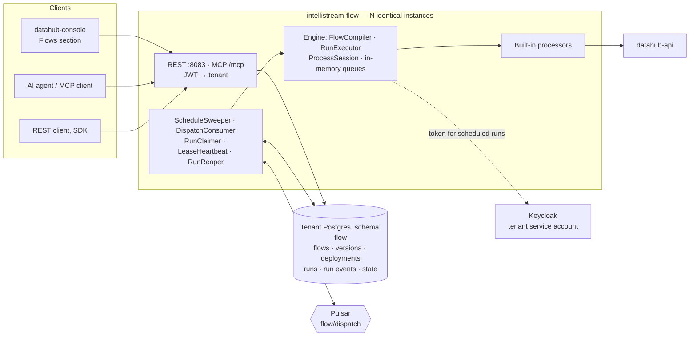

# intellistream-flow — plan

> **Status:** second draft, 2026-10-06 — for discussion in the IntelliStream team before any
> implementation starts. It replaces the first draft of 2026-08-23 (branch
> `docs/intellistream-flow-plan` on the old remote), which tried to design the engine, data
> quality, user-supplied code, change-data-capture and agents in one document. This draft designs
> **the engine only**, and lists the rest as add-ons to be decided one at a time. Decisions are in
> the table below with dates; once work begins, this document is the spec and the table is updated
> in the same PR as any deviation.

## What this is

DataHub will get a new service, **intellistream-flow**, that runs *flows*: small pipelines that
read data from somewhere, transform it, and write it somewhere — on a schedule or when someone
asks. A flow is a configurable tree of *processors*, saved as a versioned definition, and every run
records what happened to the data that went through it.

The design takes its ideas from Apache NiFi (processors wired by named outcomes, each step a small
transaction, a record of everything that happened to each item) but **not its code**. NiFi keeps
its queues on local disk and coordinates nodes with ZooKeeper; we want a service you can run any
number of identical copies of, with all shared state in Postgres. So the engine is ours, and
smaller than NiFi's.

The first version is deliberately plain: a working, reliable processing tree with a handful of
built-in processors. Connectors to external systems, data quality, user-supplied code and agents
are what the roadmap builds on it later. The engine is shaped so that each of them is an *addition* — a new
processor, a new trigger, a new table — not a change to what is already there.

## Scope

**The first version does:**

| Capability | |
|---|---|
| Flow definitions | JSON or YAML, versioned; old versions kept |
| Triggers | Manual and schedule |
| Processing tree | Processors wired by named outcomes; one outcome may feed several processors |
| Built-in processors | Read and write DataHub timeseries; write events; map, filter, route |
| Preview | Run a flow without writing anything |
| Scale and resilience | Any number of identical instances; a dead instance's run is picked up by another |
| Record of what happened | Per item, per step, per run — for any kind of data |
| Reproducibility | Every run records the flow version, the values it ran with, and the processor versions |
| Interfaces | REST, MCP, and a *Flows* section in the console |

**It does not:**

- **Store data.** Flows reads and writes through datahub-api like any other client. Timeseries,
  events and the graph stay where they are; the new tables have no foreign keys to existing ones.
- **Act as a durable queue.** Items between processors live in memory; the source is the durable
  copy (see *Why the queues are in memory*).
- **Process streams statefully.** No windowed joins across streams, no exactly-once guarantees.
- **Run long jobs.** A run must fit in memory on one instance; work that takes days is chunked
  into windows.
- **Alert or draw dashboards.** Failures become ordinary DataHub events; dashboards use the
  existing live-update path.
- **Connect to external systems, check data quality, run tenant code, or host agents** — not yet.
  Those are the add-ons listed at the end, each to be designed in its own right. Connectors in
  particular are a goal, not an exclusion: a flow whose first step listens to an OPC UA server
  and writes timeseries is where this is heading (see *Continuous sources and connectors*). Until
  then, data arrives through the ingest API as today, and a flow picks it up from there.

## Decisions so far

| Topic | Decision | Date |
|---|---|---|
| Engine | Our own engine and API; NiFi used as a design reference only. | 2026-08-22 |
| Queues between processors | In memory, inside one run. Durable (Pulsar-backed) connections are a later add-on; the definition format allows for them from the start. | 2026-08-22 |
| Identity for unattended runs | One Keycloak service account per tenant (the `datahub-service-<tenant>` clients that already exist in the dev realm). | 2026-08-22 |
| NiFi licence | Design borrowed freely; an individual class may be ported under its Apache notice with attribution and a "modified" marker (a documented exception to the AGPL-header rule). The NiFi name stays out of product and module names. | 2026-08-23 |
| Tables | New tables only, in a Postgres schema called `flow` inside each tenant's existing database. No foreign keys to existing tables. | 2026-08-23 |
| Batch format | **Arrow** is the engine's in-memory format for record batches. The `--add-opens` JVM flag is part of the service from the start, with a startup check that fails fast if it is missing. | 2026-08-23 |
| Cores | One instance per NUMA node (existing pattern); the run is the unit of parallelism. Defaults stay single-threaded. | 2026-08-23 |
| Words | A step is a **processor** (NiFi's own term). The ontology's `FUNCTION` node type keeps its meaning and is not renamed. Other words: `Flow`, `Connection`, `Run`, `Item`. Console section: **Flows**. | 2026-09-08 |
| Tenant configuration | **All in Vault**, extending the existing `tenant-config/<org>` mechanism with a `flow` section. Flow secrets (HTTP or database credentials) live in the tenant's part of Vault, writable but never readable back. Secrets never go into Postgres, encrypted or not. Feature flags stay operator-owned. | 2026-09-08 |
| APIs | **REST (with server-sent events for watching a run) and MCP.** gRPC is dropped, not deferred: it had no caller, and would have meant a second security path and a code-generation toolchain. Services stay transport-agnostic, so a gRPC facade can be added if a real caller appears. | 2026-09-08 |
| ClickHouse schema ownership | Out of scope for this plan. The first version needs no ClickHouse tables. | 2026-10-05 |
| Scope | **Engine first.** The first version is the processing tree and the machinery to run it reliably (Phases 0–1). Quality, cleaning, custom code, continuous sources and connectors, agents and the designer are add-ons, each decided separately. | 2026-10-06 |
| Item | An item is **content plus attributes**. The content records its kind (`timeseries`, `events`, `records`, `json`, `bytes`). | 2026-10-06 |
| Record of what happened | The **engine** records what happens to items — not each processor — from the session calls every processor makes anyway. The record is the same for any kind of data; what is specific to timeseries (a series and a time window) is an optional reference the engine stores without interpreting. Kept in Postgres with the run in the first version. | 2026-10-06 |
| Versioning | Flow versions never change. Every run records the flow version, the actual values it ran with (time window, parameters; for a secret, which one, never its value) and the version of every processor it used. | 2026-10-06 |
| Processor | An interface declaring its properties, its outcomes (relationships), optionally what content it accepts, and what it does. Built-in processors ship with the platform. | 2026-10-06 |
| Type checking between processors | **Deferred.** The first version does not check that connected processors agree on content kind; a mismatch fails at run time and goes to the processor's `failure` outcome. Because items carry their kind and the interface has an optional `accepts` (default: any), checking can be added later without breaking existing processors or flows. | 2026-10-06 |
| Retries | **`maxAttempts` per flow, naive.** Every failure is retried alike until attempts run out; classifying failures is an add-on. With more than one attempt, a retried run writes its output again; the flow's author decides whether that is acceptable. There is no requirement that sinks be safe to repeat. | 2026-10-06 |
| Branching | One outcome may be connected to several processors. Each receives its own copy: attributes copied, content shared (it is never modified in place). Recorded as a copy, with the original as parent. | 2026-10-06 |
| Processor configuration | NiFi's model: declared properties with types, defaults and allowable values; dynamic properties a processor interprets; dynamic relationships. `${…}` is substitution only; logic is an `expression` property. | 2026-10-06 |
| Expression language | **Open — for confirmation.** Recommendation: **CEL** — no side effects, always terminates, typed and checked on save, Apache-2.0 Java implementation. Rejected: Spring's SpEL (can call arbitrary Java), NiFi's Expression Language (tied to NiFi's runtime). SQL over records is a candidate for a later `query.records`, not a replacement. | 2026-10-06 |
| Who may edit and run flows | **Open — for confirmation.** The first draft proposed realm roles (`DATAHUB_FLOW_EDITOR`). Since then the platform has moved to organization groups for access (dataset grants, and per-scope settings grants such as `/settings/llm/read\|write`). Recommendation: organization groups `/flows/read` and `/flows/write`, in the same grammar. | 2026-10-06 |

## Glossary

- **Flow** — a pipeline definition: processors wired together, stored as JSON or YAML, versioned.
  Editing a flow creates a new version.
- **Processor** — one step in a flow, e.g. "read timeseries", "map values", "write events". It
  declares its configurable properties and its relationships.
- **Relationship** — a named outcome of a processor (`success`, `failure`, `matched`…). A
  connection links one processor's relationship to the next processor, so routing is by outcome.
- **Connection** — an edge from a processor's relationship to another processor.
- **Item** — one piece of data moving through a flow: attributes plus content. Usually a
  *batch* — for timeseries, one series over one time window — not a single value.
- **Run** — one execution of a flow, from trigger to completion, on one instance.
- **Deployment** — a flow version that is switched on, with its trigger and limits. One per flow.
- **Lease** — a row in Postgres saying "instance X owns this run until time T". Instances renew
  their leases while working; if one dies, its leases expire and another instance takes over.

## User stories

1. *As a data engineer, I want to define a flow in JSON or YAML — read `ts_raw`, transform it,
   write `ts_out` — validate it, deploy it on an hourly schedule, and watch its runs in the
   console, so that a pipeline is a versioned definition rather than a cron job on a server.*
2. *As a data engineer, I want to preview a flow on the last hour of data and see what it would
   write without writing it, so that I can build and debug without polluting real series.*
3. *As a data engineer, I want to send the same data down two tracks in one flow — one writing a
   transformed series, one raising events — so that I don't have to read it twice.*
4. *As an operator, I want to run as many identical instances of the service as I like, on any
   machines, and have a run that was in progress on a dead instance picked up by another within a
   couple of minutes, so that capacity and resilience are a matter of instance count.*
5. *As an operator, I want a deployment that keeps failing to raise a DataHub event in the
   tenant's own event stream, so that failures show up on dashboards without a separate alerting
   system.*
6. *As a tenant administrator, I want my flows and runs to be invisible to every other tenant,
   and to switch the feature on per tenant.*
7. *As a tenant administrator, I want scheduled runs to act under a service account whose dataset
   access I control through the same organization groups as users, and only people I choose to
   be able to change flows.*
8. *As an analyst, I want to find which run produced a value, which flow version and settings it
   used, and what each processor did to it, so that a surprising value can be explained.*
9. *As a flow author, I want processor names and properties to stay stable across releases, with
   renames aliased and removals announced, so that my flows keep loading.*
10. *As an AI agent, I want to list flows, read the processor catalog, write and validate a flow,
    preview it, start a run and read its result through MCP tools — and hand a new flow to a
    person to switch on, so that I can build pipelines without being able to deploy them myself.*

---

## How it works



### A flow and a run

A flow is a graph: processors as nodes, connections as edges, each connection leaving a processor
on one of its relationships. When a run starts, the service builds the graph in memory, gives the
first processor its input (a schedule tick, or items the caller posted), and keeps invoking
processors whose input queue is non-empty until every queue is empty.

Each invocation is a small transaction: the processor takes items, creates or changes items, and
transfers each to a relationship. If it throws, that invocation's changes are discarded and it is
retried a configured number of times. Whatever reaches an *output port* is saved as the run's
result. Only when the whole run has finished is the source told "done" — the cursor for the next
scheduled read is advanced.

**Every run covers an explicit time window** `[from, to)`. A scheduled run takes it from the
schedule; a manual run supplies it or defaults to the last interval. Nothing reads "whatever is new
since last time" without saying which window that was. This is what makes a run reproducible, and
what a later backfill ("re-run March") is built from: many runs with given windows.

### Items

An item is attributes (a small string map) plus content. The content knows its kind:

| Kind | What it holds |
|---|---|
| `timeseries` | One series over one window: Arrow batch of `(timestamp, value)` |
| `events` | A batch of DataHub events |
| `records` | Rows with an Arrow schema |
| `json` | A JSON document |
| `bytes` | Anything else, with a media type |

Content is never modified in place: a processor that changes it produces new content. That makes
copying an item cheap (see *Branching*) and is what lets the engine record a content hash before
and after each step. Large content spills to a local temp file.

### Branching

A relationship may be connected to any number of processors. Each connection gets its own copy of
the item: the attributes are copied, the content is shared. A change one branch makes to its
attributes is invisible to the other. The engine records the copy, with the original as parent.

Several connections may also lead *into* one processor; it receives items from all of them on one
queue. There is no joining by key — matching items from two branches is a processor's job, and not
one the first version ships.

The validator rejects cycles.

### What the engine records

The engine records every action a processor takes through its session — created an item, read it
from somewhere, sent it somewhere, changed its attributes or content, split it, copied it, routed
it to a relationship, dropped it. One record per action:

> run · attempt · processor · action · item id · parent item ids · relationship · content kind ·
> size · hash · changed attributes · entity reference · duration

The *entity reference* is optional and opaque to the engine. The DataHub timeseries processors set
it to the series and the time window, so "which run produced this value?" is a lookup by series and
timestamp. A flow moving files or JSON documents gets the same record without one.

Processors do not report these themselves. Because the engine derives them from the session calls
every processor makes anyway, a new processor is recorded correctly without doing anything.

In the first version the records are written to Postgres in the run's final transaction, with a
per-run cap and a *truncated* marker. Flows should keep a batch as one item, so a run produces tens
or hundreds of records, not millions. When volume calls for it, the records move to ClickHouse
behind the same interface (see *Add-ons*).

### Versioning and reproducibility

A flow version is immutable once saved. A run records:

- the flow version;
- the values it ran with — the time window, every parameter as resolved; for a secret, which
  secret, never its value;
- the version of every processor in the flow (built-in processors change with platform releases).

Together these answer "why did the same flow give a different result last month?" without
guessing.

### Why the queues are in memory

NiFi writes every queue to local disk because it acknowledges the source the moment data arrives
and then promises never to lose it. We hold the acknowledgement until the run completes instead,
so the *source* stays the durable copy: a schedule's cursor is only advanced at the end of a run,
and DataHub's timeseries can be read again. The one case without a replayable source is data
pushed at the API ("run this flow on these items"): the service writes those items to Postgres
with the run **before** it answers, so that is the durable point.

The trade-off: a run has to fit in memory; one slow step slows the whole run rather than building
a backlog; all steps of a run execute on the same instance. For a connection that needs a real
backlog — a flaky sink, a step that should scale on its own — the definition format accepts
`durable: true` from the start, and a later add-on implements it by splitting the flow at that
point with a Pulsar topic in between. Until then the flag is rejected by the validator.

### How many instances share the work

Every instance is identical and runs the same loops. All coordination is rows in Postgres; Pulsar
only carries "there is work" notifications.

1. **Schedule sweep.** Every ~10 seconds each instance asks each tenant's database for schedules
   that are due, locking the rows it picks (`SELECT … FOR UPDATE SKIP LOCKED`). For each, it
   inserts a *pending* run, moves the schedule forward, and publishes "run X is ready" to Pulsar.
2. **Claim and execute.** Whoever receives that message tries to claim the run with a single
   `UPDATE` that only succeeds if the run is still pending. If it succeeds, the run executes on that
   instance; if not, the message is dropped. Only one instance ever executes a given attempt, so a
   message delivered twice does not run twice. While running, the instance renews its lease every
   15 seconds, with an update that only succeeds if it is still the owner. When the run finishes,
   one transaction writes the result, the records, the saved processor state and the final status
   — again only if this instance still owns the run.
3. **Reaper.** Every 30 seconds each instance looks for runs whose lease expired. Those go back to
   pending for another attempt, or are marked failed when the flow's `maxAttempts` is used up. It
   also republishes pending runs whose notification got lost.

### Retries

A flow sets `maxAttempts` (default 1). The trade-off is the author's:

- **`maxAttempts: 1`** — a run that fails, or whose instance dies, ends as `FAILED`. Nothing is
  retried automatically; someone triggers it again if they want it.
- **More than 1** — the whole run is retried from the start, so whatever it wrote before failing
  is written again. For datapoints that is harmless: a datapoint with the same series and
  timestamp replaces the earlier one. For other sinks it depends on the sink, and the processor's
  documentation says so.

A failed attempt's partial output stays visible until a retry overwrites it, or for good if there
is no retry. The design accepts that rather than staging writes.

Separately from the run, a single processor invocation that throws can be retried within the run
(`retry` on the processor in the definition) — useful for a sink that times out now and then.

**Retries are deliberately naive in the first version:** every failure is retried the same way,
whatever caused it, until the attempts run out. A bad property or a 403 is retried as faithfully
as a timeout, which wastes the attempts but is harmless. Telling failures that are worth retrying
from those that are not is an add-on (*Failure classes*).

### What happens when something dies

The principle: **nothing that matters lives only on the machine that died.** The source keeps the
input until the run has finished, and the run's state is a lease in Postgres that any instance can
take over.

| What dies | How it is noticed | What happens |
|---|---|---|
| An instance, mid-run | Its lease stops being renewed (every 15 s; expires after 60 s) | The reaper re-queues the run (attempt + 1) or marks it `FAILED (LEASE_LOST)`; another instance runs it from the start. Within about 90 s. |
| Postgres, for longer than a lease | Heartbeats fail | **Self-fencing:** an instance that cannot renew its lease by the time it expires treats itself as fenced and aborts the run, so there is never a second live copy when Postgres returns. No new claims; sweeps pause. |
| Pulsar | Publish or consume errors | Dispatch stalls; pending runs pile up and the reaper republishes them when Pulsar returns. Runs already executing finish normally. |
| A whole host | Leases expire | As for an instance. |

### What this costs Postgres

Nothing on the data path goes through Postgres: items move in memory. The load is control traffic
— small, single-row, indexed statements, spread over the tenants' own databases:

| Source | Rate | At 100 instances · 50 tenants · ~1,000 runs in flight |
|---|---|---|
| Schedule sweep | every 10 s per instance per tenant | ~500 mostly-empty queries/s |
| Reaper | every 30 s per instance per tenant | ~170/s |
| Lease heartbeat | every 15 s per running run | ~70 single-row updates/s |
| The run itself | ~5 statements per run | ~500/s at an extreme 100 runs/s |

Roughly 1,000–1,500 statements/s across the cluster at full tilt — tens per second per tenant
database. Three details matter more than the totals:

- **One transaction per tenant per tick**, never one per row: there is no application-side
  connection pool by design (pgbouncer), so connection churn is the real per-statement cost.
- **Heartbeats must be HOT updates:** no index on `run.lease_expires_at`. The reaper uses a partial
  index on `status = 'RUNNING'` and filters expiry in memory.
- **Bloat comes from churn:** `run` rows are updated several times and deleted by retention, so
  retention deletes in batches and `run` gets a lower autovacuum scale factor.

The sweep and reaper are the only parts that grow with **instances × tenants** rather than with
work. At several hundred tenants, tenants are sharded across instances.

### Tenants

Each tenant already has its own Postgres database and Pulsar tenant. The new tables sit in a `flow`
schema in the tenant's database (Flyway, from **V45**) and reference nothing outside it — a flow
refers to a dataset by its external id and calls datahub-api over HTTP. Every run thread sets
`TenantContext`, as the API does. Each tenant has a concurrency budget. A tenant gets the feature
through a `flow` flag next to `policy`, `streaming` and `chat` in the operator-owned tenant
configuration.

### Who a run acts as

Today every call between our services carries the *user's* JWT. A scheduled run has no user, so
it calls datahub-api as the tenant's **service account**: **one per tenant**, shared by all of that
tenant's flows and runs — never one per flow or per run. Each instance holds one token per tenant
(client credentials, through the SDK's existing `TokenProvider`), reuses it across runs and renews
it before it expires. The service account is granted
dataset access through the same organization groups as a user, so the existing ACLs apply. Its
credentials are in the tenant's `flow` section in Vault.

A manual run acts as the person who started it.

Because the service account usually has broader dataset access than any one person, changing a
flow is a separate permission from reading one (see the open row in *Decisions*).

---

## The processor interface

Every processor — built-in now, tenant-supplied later — implements one interface. A sketch:

```java
public interface Processor {

    /** Name, version, properties, relationships, and (optionally) what content it accepts. */
    ProcessorDescriptor describe();

    /** Problems with a combination of property values that no single property can see. */
    default List<String> validate(PropertyValues properties) { return List.of(); }

    /** Take items from the session, produce or change items, transfer each to a relationship. */
    void onTrigger(ProcessContext context, ProcessSession session) throws ProcessException;
}
```

- **`ProcessorDescriptor`** — a stable name (`datahub.timeseries.source`), a version, the
  properties, the dynamic properties if it takes any, the relationships (fixed, or one per dynamic
  property), and `accepts`, which defaults to *any* and is not checked in the first version.
  Published in the catalog as JSON schema, which is what the console's forms and an agent read.
- **`ProcessContext`** — resolved property values and compiled expressions; the run's window and
  parameters; secrets by name; saved state (a small per-processor value that survives between
  runs, such as a cursor); a DataHub client for the run; whether this is a preview; whether the run
  has been cancelled or its lease lost; and a log that ends up on the run's page.
- **`ProcessSession`** — `get`, `create`, `putAttribute`, `write`, `transfer(item, relationship)`,
  `remove`. Each call is what the engine records. A processor has no other way to touch items.

The interface lives in its own module under Apache-2.0 (`intellistream-flow-api`), for the same
reason `datahub-api-model` is: a partner's processor, or later a tenant's, must not be forced
under the AGPL. The engine and service are AGPL — including the expression evaluator, which a
processor reaches through its context rather than depending on it.

Processor names and properties are part of the contract: a rename keeps the old name as an alias,
and a removal is announced at least one release in advance.

## Configuring processors

Processors are configured the way NiFi's are: each declares its properties, a flow sets values for
them, and nothing about a processor's behaviour is written as code in the flow except expressions.

### Properties

Every property declares:

| Field | |
|---|---|
| `name` | Stable key used in the flow definition (`createMissing`) |
| `displayName`, `description` | For the console's form and the catalog |
| `type` | `string`, `number`, `boolean`, `duration`, `instant`, `list`, `enum`, `secret`, `expression` |
| `required`, `default` | A required property without a default must be set |
| `allowableValues` | For `enum`: the values, each with a description |
| `references` | Whether `${…}` references are allowed in the value (below) |
| `sensitive` | Never shown or logged; must be a `secret` reference |

**Dynamic properties** are user-named properties a processor interprets, as in NiFi's
UpdateRecord and RouteOnAttribute. The processor declares what the key and the value mean — for
`record.map`, the key is a column name and the value an expression. In the catalog's JSON schema
they are `additionalProperties`, with that description. A processor may give each dynamic property
its own relationship (`route.on.attribute` does).

**Validation** happens when a flow is saved: types, required properties, allowable values, that
expressions compile, that secrets and parameters exist, and the processor's own `validate` for
combinations ("set `dataSet` when `createMissing` is true").

### References and expressions — two separate things

- **`${…}` is a reference**, substituted into a property's value: a flow parameter
  (`${parameters.window}`), the run's window (`${run.window.start}`, `${run.window.end}`), or an
  attribute of the item being handled (`${timeseries.externalId}`). No operators, no functions —
  only substitution. Run-level references are resolved once per run, attribute references once per
  item.
- **An expression** is a property of type `expression`, evaluated by the engine — for most
  processors once per row. It sees the row's columns by name (`value`, `timestamp`), the item's
  attributes as `attr` (`attr["timeseries.externalId"]`) and the flow's parameters as `params`
  (`params.limit`). Expressions do not use `${…}`: they read the same values directly, so a value
  can never change what an expression *means*.

The expression language is **CEL** (Common Expression Language), proposed for confirmation (see
*Decisions*): no side effects, guaranteed to terminate, typed and checked when the flow is saved,
used by Kubernetes and Envoy, with a maintained Java implementation (`cel-java`, Apache-2.0). An
expression is compiled once per run and evaluated per row.

### Built-in processors in the first version

**`datahub.timeseries.source`** — reads series over a window. Produces one `timeseries` item per
series (columns `timestamp`, `value`).

| Property | Type | Default | |
|---|---|---|---|
| `timeseries` | list | — (required) | External ids of the series |
| `from` | instant | `${run.window.start}` | |
| `to` | instant | `${run.window.end}` | |
| `maxPointsPerItem` | number | 100,000 | A longer series is split into several items |
| `onMissing` | enum | `fail` | `fail` the run, or `skip` the series |

Relationships: `success`. Sets attributes `timeseries.externalId`, `window.start`, `window.end`.

**`datahub.timeseries.sink`** — writes datapoints. Accepts a `timeseries` item, or `records` with
a timestamp and a value column. The item passes on unchanged after it is written.

| Property | Type | Default | |
|---|---|---|---|
| `target` | string, references | `${timeseries.externalId}` | Series to write to, e.g. `${timeseries.externalId}_f` |
| `createMissing` | boolean | `false` | Create the series if it does not exist |
| `dataSet` | string | — | Dataset for created series; required if `createMissing` |
| `timestampColumn`, `valueColumn` | string | `timestamp`, `value` | |

Relationships: `success`, `failure`. In preview, reports the target and the number of points
instead of writing.

**`datahub.events.sink`** — creates one DataHub event per row.

| Property | Type | Default | |
|---|---|---|---|
| `type` | string, references | — (required) | |
| `subType` | string, references | — | |
| `externalId` | expression | — | If unset, the platform assigns one |
| `dataSet` | string | — | |
| `startTime` | expression | `timestamp` | |
| `endTime` | expression | — | |
| `description` | expression | — | |
| *dynamic* | expression | | Key: a metadata key on the event. Value: its expression. |

Relationships: `success`, `failure`. In preview, reports the events instead of creating them.

**`record.map`** — computes columns (NiFi's UpdateRecord).

| Property | Type | Default | |
|---|---|---|---|
| *dynamic* | expression | | Key: a column name, new or existing. Value: its expression. Every expression sees the input row, not each other's results. |
| `onError` | enum | `fail` | `fail` sends the item to `failure`; `null` sets the column to null for that row |

Relationships: `success`, `failure`.

**`filter.records`** — splits an item's rows by a condition.

| Property | Type | Default | |
|---|---|---|---|
| `condition` | expression | — (required) | Must be boolean |

Relationships: `matched`, `unmatched`, `failure`. Both sides keep the item's attributes; an empty
side is not emitted.

**`route.on.attribute`** — routes whole items by their attributes (NiFi's RouteOnAttribute).

| Property | Type | Default | |
|---|---|---|---|
| *dynamic* | expression | | Key: a relationship name. Value: a boolean expression over `attr` and `params`. |
| `strategy` | enum | `each` | `each`: to every relationship whose expression is true (one copy each); `all`: to `matched` if all are true; `any`: to `matched` if any is |

Relationships: one per dynamic property (`each`) or `matched` (`all`, `any`); always `unmatched`.

## A flow definition

```jsonc
{
  "schemaVersion": 1,
  "externalId": "temp_hourly",
  "name": "Hourly temperature: Fahrenheit series and over-limit events",
  "parameters": {
    "window": { "type": "duration", "default": "PT1H" },
    "limit":  { "type": "number",   "default": 140 }
  },
  "processors": [
    { "id": "src",  "type": "datahub.timeseries.source",
      "properties": { "timeseries": ["ts_out_temp"] } },          // window: the run's, by default
    { "id": "f",    "type": "record.map",
      "properties": { "value": "value * 1.8 + 32" } },              // dynamic: column -> expression
    { "id": "out",  "type": "datahub.timeseries.sink",
      "properties": { "target": "${timeseries.externalId}_f",
                      "createMissing": true, "dataSet": "ds_demo" },
      "retry": { "maxAttempts": 3, "backoff": "PT5S" } },
    { "id": "over", "type": "filter.records",
      "properties": { "condition": "value > params.limit" } },
    { "id": "ev",   "type": "datahub.events.sink",
      "properties": { "type": "temperature", "subType": "over-limit",
                      "series": "attr['timeseries.externalId']" } }  // dynamic: metadata key -> expression
  ],
  "connections": [
    { "from": "src",  "relationship": "success", "to": "f" },
    { "from": "f",    "relationship": "success", "to": "out" },   // the same outcome feeds two
    { "from": "f",    "relationship": "success", "to": "over" },  //   processors: each gets a copy
    { "from": "over", "relationship": "matched", "to": "ev" }
  ],
  "trigger":   { "type": "schedule", "cron": "0 0 * * * *", "timezone": "Europe/Oslo",
                 "window": "${parameters.window}" },
  "execution": { "maxConcurrentRuns": 1, "maxAttempts": 1, "timeout": "PT15M" }
}
```

---

## What is built when

### Before Phase 0

Three small pieces of the tenant configuration work that has already shipped:

- a `registry/notify` Pulsar topic, copying the `subscriptions/notify` pattern, so a configuration
  change reaches every instance in seconds rather than at the five-minute refresh;
- a `flow` section in `tenant-config/<org>`, for the service-account credentials and flow secrets;
- the settings-grant handling (`SettingsGrants`, currently in datahub-api, and `SettingsScopes`)
  made usable outside datahub-api, so the flow service can resolve the same grants.

### Phase 0 — Foundations

The modules, the build, security and tenant plumbing, the `flow` schema, the deployment files.
Nothing user-visible yet.

- Modules `intellistream-flow-api` (Apache-2.0, the processor interface) and `intellistream-flow`
  (AGPL, engine and service), following the existing conventions; AGENTS.md's licensing section
  lists the new Apache module.
- JWT → organization → `TenantContext`; tenants without the `flow` flag get 404, tenants not yet
  provisioned 503.
- Flyway V45: the `flow` schema (Appendix A).
- The compose service, the systemd unit, the `flow/dispatch` topic, Keycloak groups.
- Metrics follow CONSTRAINTS #5: no tenant or deployment on any Prometheus metric. Management port
  9084, off by default, the same `@Order(1)` chain as the other services.

**Done when** the service boots in the compose stack, answers `GET /catalog/processors` with a
valid JWT, and the `flow` schema exists in the `foo` and `bar` tenant databases.

### Phase 1 — The processing tree

Define a flow, deploy it with a manual or schedule trigger, have it run on any instance, read and
write DataHub timeseries and events, see the run and what happened in the console, and drive it
from MCP. This is the phase that proves the coordination model.

Contents: flow create/read/update and versions; validation (structure, properties, references,
cycles — not content kinds); the engine; branching; the sweep, claim, lease and reaper loops;
`maxAttempts` and per-processor retry; the run record (version, resolved values, processor
versions); the engine's record of what happened; the six built-in processors; preview; service
account tokens; a failure event after repeated failed runs; retention of old runs in
datahub-cleanup; the console's Flows section (list, definition, deploy, runs, a run's steps and
records); the MCP tools.

**Done when:** the example flow above runs hourly on a two-instance stack; killing the instance
running it mid-run gets it re-run (with `maxAttempts: 2`) or marked failed (with `1`) within two
minutes; preview writes nothing; and for any value it wrote, the console shows which run, flow
version, parameter values and processor versions produced it.

## What stays open for the add-ons

The first version is shaped so that each add-on is an addition. These are the points it must not
close off:

1. **Items are content plus attributes.** A quality class, a confidence or an origin becomes an
   attribute; no processor changes.
2. **The engine records what happened**, so a new processor — including tenant-supplied code — is
   recorded without doing anything.
3. **Every run has an explicit window**, so backfill and re-evaluating late data are many runs with
   given windows.
4. **Flow versions are immutable and runs record what they ran with**, so later audit and lineage
   have something to point at.
5. **The processor interface is the only extension point.** A quality checkpoint, a cleaning step
   and a tenant's Python step are each just another processor.
6. **The definition format has a version** and an agreed rule for fields it does not know, so
   `durable` and later fields can be added.
7. **Items carry their content kind and processors may declare `accepts`**, so type checking
   between processors can be switched on without breaking anything.
8. **A source can be long-lived.** The first version's sources read once per run, but nothing in
   the engine may assume that: a run must be startable with items handed to it by a listener, and
   the definition's trigger types must be open to a `listener` trigger. That is what connectors
   (an OPC UA server, for instance) are built on.

## Add-ons — not designed here

Each of these gets its own design and decision before work starts. The first draft has a fuller
treatment of most of them and is a starting point, not a decision.

- **Data quality and the audit.** Checkpoints that measure completeness, validity, timeliness and
  consistency and classify batches as good, degraded or bad; the audit that answers "was this
  report built on good data for this period?"; sensor calibration tables in the graph.
- **Cleaning.** A `timeseries.clean` processor (interpolate, despike, clip, resample). The first
  draft names the operations but not their parameters, their order, how they treat window edges,
  or what they do with removed values; all of that needs deciding.
- **Type checking between processors.** Switch on `accepts`, and check record schemas where they
  are known.
- **Records at scale.** Move the engine's records from Postgres to ClickHouse when volume calls for
  it; lineage between datasets in the knowledge graph; OpenLineage export; keeping copies of a
  step's input and output for debugging.
- **Backfill and late data.** Re-run a period as many windowed runs without touching the live
  schedule.
- **Failure classes.** Classify failures — *transient* (timeouts, 5xx, 429: retry), *permanent*
  (4xx, bad configuration, bad data: fail at once, or send the item to `failure`), *over a limit*
  (memory, timeout: fail, no retry), *instance lost* (retry once, then mark the run suspect so a run
  that kills instances cannot kill one after another), *cancelled*. In the processor interface this
  is two exception types; an unclassified exception counts as permanent. `maxAttempts` then limits
  transient failures only.
- **Custom processors.** Tenant-written Python or WebAssembly, scanned, reviewed and approved
  before it can be deployed, and always run in a sandbox. Includes who pays for the LLM review.
  Tenant-supplied Java may never be supported: the JVM cannot contain code running inside it (its
  Security Manager is permanently disabled since JDK 24), so Java loaded into the service would see
  every tenant's data and credentials.
- **Continuous sources and connectors.** A source step that keeps running and listens, rather than
  reading once per run: an OPC UA subscription, MQTT, a polled Modbus or HTTP endpoint,
  change-data-capture from a customer database, or DataHub's own datapoints, events and resource
  changes. This is how Flows becomes an ingest path — e.g. an OPC UA connector writing timeseries.
  The first draft's outline: one instance hosts each listener under a lease (renewed every few
  seconds, taken over by another instance if it dies), and incoming data is cut into small runs by
  time or count, so everything downstream works as in the first version. A listener is a second
  interface next to `Processor`, not a change to it — roughly `start(context, emitter)` and
  `stop()`, with the engine deciding where each batch the emitter hands over becomes a run. Points
  the design must settle:
  - **Not every source can replay.** The first version relies on the source keeping data until a
    run finishes. An OPC UA subscription does not: values that arrive while no instance holds the
    lease, or that were in memory when an instance died, are gone unless the server keeps history
    (OPC UA Historical Access) to fill the gap from. Each connector has to state what it can
    recover.
  - **Batching, not one run per message.** A run costs about five Postgres statements, which is
    fine per minute and not per value; the listener must cut batches large enough for that.
  - **Connections and credentials** to customer systems — the outbound allow-list, certificates
    (OPC UA uses them), secrets in Vault.
- **Durable connections.** Implement `durable: true`.
- **Agents.** An `agent.step` processor, building on the agent runtime work.
- **Designer.** Drag-and-drop flow editing in the console.

## Dependencies outside this plan

- **Event `externalId` as a lifecycle.** Several events will share one `externalId` to record an
  event's lifecycle; today a duplicate is rejected with 409. That change is being made separately.
  Until it lands, a retried run that creates events with fixed external ids fails on its own
  earlier events, so such flows should use `maxAttempts: 1`.

## Open questions

1. **Who may edit and run flows** — organization groups `/flows/read` and `/flows/write`, or
   something else (see *Decisions*).
2. **Expression language** — CEL, or something else (see *Decisions*).
3. **A dead attempt leaves no record.** The engine's records are written in the run's final
   transaction, so an attempt whose instance died has none; the run shows the attempt and that its
   lease was lost, but not what it did before. Writing records during the run would fix that at the
   cost of more Postgres writes. Is the attempt row enough?
4. **Several runs writing one window.** A retry, or a manual run over a window the schedule already
   covered, means more than one run wrote the same values. "Which run produced this value?" needs a
   rule — the latest successful run, or all of them listed.
5. **Long manual runs.** A manual run acts as the person who started it, with their token. A run
   longer than the token's lifetime needs either a refresh or to run as the service account.
6. **Identity.** The service account usually has broader dataset access than the person who wrote
   the flow, so someone with `/flows/write` but narrow dataset access can deploy a flow that reads
   more than they can. Per-flow identities are an open question.

---

## Appendix A — Postgres tables (schema `flow`, per tenant)

| Table | Holds |
|---|---|
| `flow` | id, external id, name, current version, created/updated by and at |
| `flow_version` | flow, version, definition (jsonb), created by and at; never updated |
| `deployment` | flow, version, enabled, trigger, execution limits, enabled by and at |
| `schedule` | deployment, next due, cursor |
| `run` | deployment, version, status, attempt, max attempts, owner, lease expires at, window, resolved parameters, processor versions, trigger, triggered by, started/finished at, error, stats |
| `run_input` | items posted to the API for a run, written before the API answers |
| `run_output` | items that reached an output port; inline content capped at 1 MB |
| `run_event` | the engine's records (one per action), written in the run's final transaction, capped per run |
| `processor_state` | per deployment and processor: a small saved value and its version |

Indexes: a partial index on `run (status) WHERE status = 'RUNNING'`, none on
`run.lease_expires_at`; `run_event (run_id)` and `run_event (entity_ref, window_start)`.

## Appendix B — Run protocol, step by step

1. **Create.** The sweep or a manual call inserts `run` as `PENDING` (with `run_input` rows for
   posted items) in one transaction.
2. **Notify.** Publish `{tenantId, runId, deploymentId, attempt}` to
   `persistent://{internal}/flow/dispatch`; set `dispatched_at`.
3. **Receive.** Shared subscription. Unknown tenant → acknowledge and warn. Feature off, or no free
   slot in the instance's or tenant's budget → negative-acknowledge (redelivered later, elsewhere).
4. **Claim.** In one transaction: lock the deployment row, check `maxConcurrentRuns`, then
   `UPDATE run SET status='RUNNING', owner=:me, lease_expires_at=now()+60s WHERE id=:run AND
   status='PENDING' AND NOT cancel_requested`. Zero rows → someone else has it → acknowledge and
   stop.
5. **Acknowledge** the Pulsar message once the claim commits.
6. **Execute** under the tenant's context. Every 15 s: `UPDATE run SET lease_expires_at=… WHERE
   id=:run AND owner=:me AND status='RUNNING'` returning `cancel_requested`. Zero rows → the lease
   was taken → abort without writing anything. If no heartbeat has succeeded by
   `lease_expires_at`, abort the same way.
7. **Finish** in one transaction: update `processor_state` where the version matches (a mismatch
   fails the finish with `STATE_CONFLICT`); insert `run_output` and `run_event`; set `run` to
   `SUCCEEDED` or `FAILED`, only if still the owner. Then advance the schedule's cursor.
8. **Retry.** A failure with attempts left → back to `PENDING` with backoff; otherwise `FAILED`.
9. **Reaper**, every 30 s per tenant (`SKIP LOCKED`): expired lease → `PENDING` with attempt + 1, or
   `FAILED (LEASE_LOST)`; pending but not dispatched for a while → republish; running past its
   timeout → set `cancel_requested`.
10. **Cancel** sets `cancel_requested`; pending runs become `CANCELLED` at once, running ones at
    their next heartbeat.

All locks are transaction-scoped: safe behind pgbouncer in transaction mode, with no advisory locks
and no `LISTEN/NOTIFY`.

## Appendix C — API surface

**REST** (port 8083): `/flows` (create, list, read, update, `/validate`, `/versions`);
`/flows/{id}/deployment` (`/enable`, `/disable`); `POST /flows/{id}/runs` (with `preview=true` for
a dry run); `/runs`, `/runs/{id}` (`/cancel`, `/output/{port}`, `/events` as server-sent events,
`/records`); `/catalog/processors`.

**MCP** (`POST /mcp`): `flow_list`, `flow_get`, `flow_validate`, `flow_preview`, `flow_run`,
`run_status`, `run_result`, `run_list`, `processor_catalog`. An agent may create, validate and
preview a flow; a person enables its deployment.

## Appendix D — Pulsar topics

| Topic | Partitions | Producer | Subscription | Message |
|---|---|---|---|---|
| `persistent://{internal}/flow/dispatch` | 16 | every instance (sweep, manual run, reaper) | `intellistream-flow-dispatch`, Shared | `{tenantId, runId, deploymentId, attempt}` |
| `persistent://{internal}/registry/notify` | 1 | datahub-api, after a tenant configuration write | one Exclusive subscription per instance of every service | `TenantConfigChanged{tenantId, kind}` |
