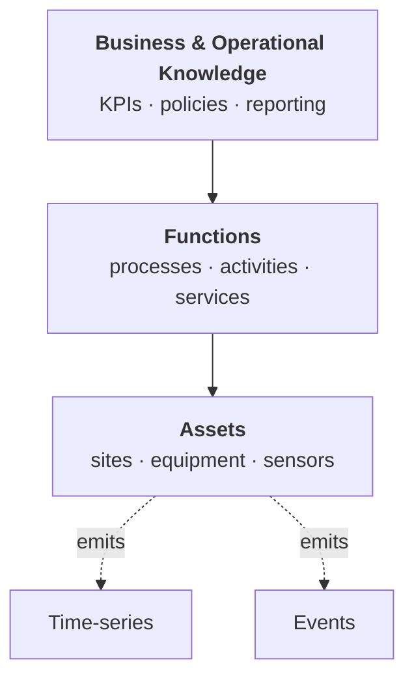
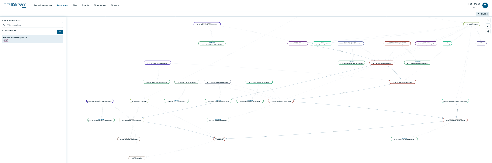
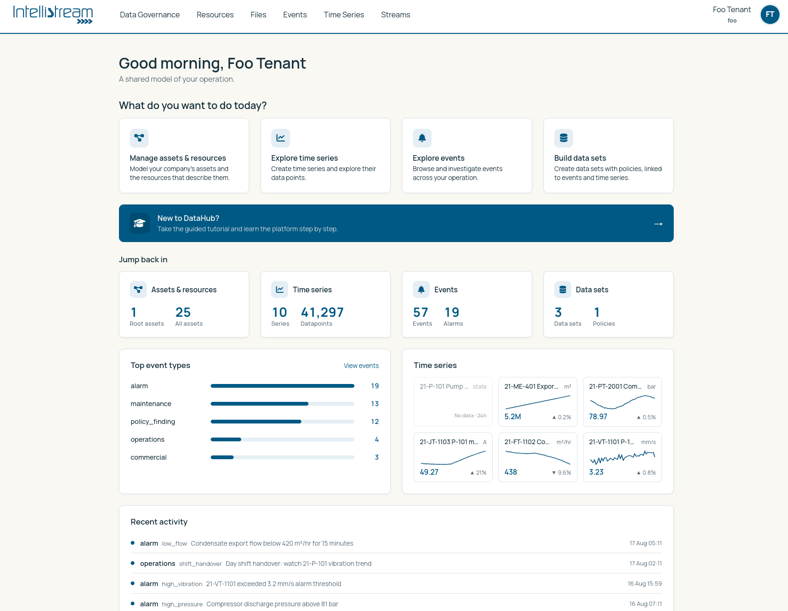
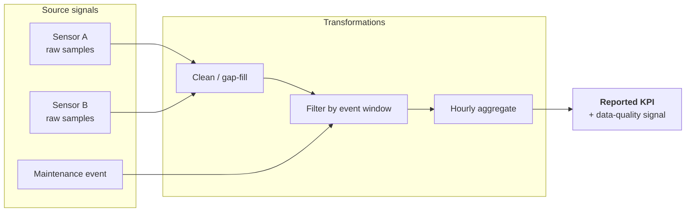
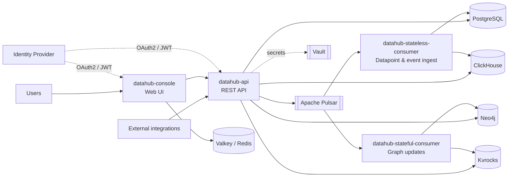

# IntelliStream DataHub

IntelliStream DataHub is an industrial data platform that gives your organization a single, coherent view of its operational data. Most data landscapes grow organically: historians, databases, message brokers, spreadsheets, and point solutions each hold a piece of the truth, but none of them hold the whole picture. DataHub closes that gap by pairing raw data (events and time-series) with an ontological layer that describes *what the data is about*: the assets it belongs to, the functions those assets perform, and the business and operational knowledge that gives them meaning.

The result is a platform where a measurement is never just a number. A pressure reading knows which pump it came from, which process that pump serves, which site the process runs on, and which operational objectives the site supports. Events carry the same context. When something changes, you can see what it changed *about*, not just what changed.

DataHub was originally inspired by Cognite Data Fusion, and it is still the same category of
platform. The direction now is more specific. Contextualized data is what makes an AI agent
useful rather than merely fluent, so DataHub is being built as a platform agents can *act* on,
not only read from: [what that looks like today](#built-for-ai-agents), and
[how it compares to the commercial platforms](FAQ.md#how-does-datahub-compare-to-platforms-like-palantir-foundry-or-cognite-data-fusion).

Learn more at [intellistream.ai](https://intellistream.ai).

## Quick start

```bash
git clone https://github.com/IntelliStream-DataHub/datahub-platform.git
cd datahub-platform
./scripts/up.sh --build
```

Then open the console **in a browser on the same host** and sign in:

| Service  | URL                     | Login           |
|----------|-------------------------|-----------------|
| Console  | `http://localhost:8080` | `foo` / `foo`   |
| API      | `http://localhost:8081` | Bearer token    |
| Keycloak | `http://localhost:8090` | `admin`/`admin` |

A container runtime is the only prerequisite: Podman, or Docker with the `docker compose`
plugin. The services are compiled inside the build container, so there is no JDK, Gradle or
Node.js to install on the host. The first run compiles the platform and pulls the backing
stores, so give it several minutes; after that, plain `./scripts/up.sh` starts what is
already built, and `podman compose down` stops it (`down -v` also wipes the data).

The stack comes up with a small demo dataset already loaded, so the console shows something
real on the first visit. Pass `--no-demo` for an empty one.
[GETTING_STARTED.md](GETTING_STARTED.md) covers the development workflow, running the apps
on the host with Gradle, and what to do when browser login misbehaves.

> **Evaluation and development only.** This stack runs without TLS, with development
> credentials and permissive database authentication. Do not expose it, and do not carry any
> of it into production. See [Deployment & Scaling](#deployment--scaling) below.

### Building and testing on the host

The quick start above needs nothing but a container runtime. To build the code or run the
services from an IDE, you also need **JDK 25**, and Gradle will download a matching toolchain
on the first build if you do not have one installed:

```bash
./gradlew build     # compiles every module and runs the unit tests
```

That is the whole of it. The unit suite is hermetic: it starts no containers and contacts no
Vault, Keycloak, Postgres or Pulsar, so it works on a fresh clone with no configuration. The
container-backed suites are separate and opt-in, and need Podman or Docker running:

```bash
./gradlew :datahub-infra:integrationTest
./gradlew :datahub-api:integrationTest
```

[CONTRIBUTING.md](CONTRIBUTING.md) covers the sign-off policy,
[GETTING_STARTED.md](GETTING_STARTED.md) the full development workflow.

## The ontological layer

At the core of DataHub is a knowledge graph that models three kinds of resources:

- **Assets**: the physical and logical things that make up your operation: equipment, sites, sub-systems, lines, zones, vehicles, meters, instruments.
- **Functions**: what those assets *do*: the processes, activities, and responsibilities they fulfil.
- **Business and operational knowledge**: organizational context: reporting hierarchies, KPIs, regulatory categories, commercial boundaries, maintenance policies, safety rules.

Resources are connected by typed relationships, so you can traverse from a sensor reading up to the business unit that cares about it, or down from a KPI to every asset whose behaviour contributes to it. The graph is open and extensible: you add the concepts that matter to *your* operation, not a fixed taxonomy we imposed on you.

## Events and time-series, in context

Ontology alone isn't enough; operational data lives or dies on the streams of events and measurements that describe how things are actually running. DataHub ingests both as first-class citizens:

- **Time-series**: continuous signals such as telemetry, sensor output, meter readings, and derived aggregates. Stored in a columnar backend tuned for high-cardinality, high-throughput querying.
- **Events**: discrete occurrences such as state changes, alarms, manual interventions, lifecycle transitions, and integrations from upstream systems.

Both are linked back into the ontology. A time-series isn't a standalone topic; it belongs to an asset, which participates in a function, which rolls up into a business view. An event isn't an isolated record; it's anchored to the resource it describes. This makes it possible to answer questions that would otherwise require joining half a dozen systems by hand: *Which assets supporting this function saw anomalous readings during yesterday's shift, and what events were raised against them?*



## A map of your data

The web console turns the graph into something you can actually see and navigate. You get a map of your data: how streams flow through your assets, how assets connect to one another, and how the whole network relates to the business and operational knowledge that frames it. You can start from a KPI and drill down to the raw signals driving it, or start from a sensor and zoom out to the reports that depend on it. It's designed to be usable by people who aren't data engineers: operations staff, analysts, and subject-matter experts should be able to explore the model without writing queries.





## Lineage-backed data quality traceability

> **On the roadmap, not built yet.** Everything else on this page is running code. This section
> describes where the platform is going, and it is here because it is the reason the ontology is
> shaped the way it is.

The intent: every derived value carries its lineage, so when a number shows up in a dashboard or
report you can trace it back through every transformation, join, and filter to the original
measurements and events it was computed from. Data quality signals ride alongside that lineage, so
a reported figure comes with an accuracy story: which inputs were complete, which were
interpolated, which were flagged, and which are missing. That turns reports from claims into
auditable artifacts, useful for internal trust and essential for regulated reporting.

Waiting for it is the wrong move, and this is the practical part. Connecting your data sources and
building out the contextualization layer is the slow work, and it is work you do once. Lineage
lands on top of the model you build in the meantime, on the assets, functions and relationships
already in place. Starting now is what makes it useful on the day it arrives, rather than the day
you begin modelling.



## Who it's for

- **Data scientists and analysts**: query a semantically linked model of assets, events, and time-series rather than a scattered collection of tables and topics. Build models on data that already carries its context, and publish derivatives back into the graph.
- **Operations teams**: connect raw data to physical and business context; investigate incidents by following relationships rather than chasing down integrations.
- **Subject-matter experts and domain owners**: curate the ontology that describes your operation. Keep the model of *what matters* close to the people who understand it best.
- **Developers and integrators**: build on a REST API (OAuth2 / JWT), stream via Apache Pulsar, and query time-series via ClickHouse. The platform is designed to be embedded, extended, and automated against, not just used through its own UI.

## Built for AI agents

An ontological layer plus streams of events and time-series is a strong foundation for AI, because an agent sees context, not just signals. DataHub ships that surface today:

- **MCP servers** ([Model Context Protocol](https://modelcontextprotocol.io)): datahub-api serves its entity and graph tools at `POST /mcp`, and datahub-analysis serves the relationship analysis at its own `/mcp`. Both ride the ordinary OAuth2 filter chain — a standard Bearer JWT per request, with tenant routing and per-dataset ACLs applied exactly as on REST. Connect Claude, an IDE, or your own agent with nothing but a token.
- **Statistical relationship analysis as a tool**: `analysis_related_series` walks the knowledge graph outward from a focus series for physically related candidates, then tests each pair — lagged cross-correlation (raw and ARIMA-prewhitened with significance gating), Engle–Granger cointegration, correlation stability, and Welch coherence — returning a compact ranked verdict instead of raw arrays. The graph traversal tools (`resource_fetch_related`, `resource_fetch_nearest`) give agents the same "which series measure this pump?" navigation the analysis itself uses.
- **Context-window discipline**: MCP results use lean projections with nulls and empty fields stripped, explicit truncation flags on capped lists, and spectra/audit fields dropped — tool output is sized for a model's context, not a browser.
- **A built-in console assistant**: an optional chat panel in the web console (Anthropic or any OpenAI-compatible/self-hosted model) that answers questions about your tenant's data using a strictly read-only allowlist of these tools, as the signed-in user.

The console assistant is read-only by design — mutating tools are never offered to its model. A direct MCP client sees the full tool set, but every call is authorised by the caller's own token, so scoping an agent is the same act as scoping any service account: grant its dataset groups read-only and it cannot write. Planned next: anomaly detection, data cleaning, and event detection built on the same graph-plus-signals foundation.

## Architecture

DataHub is delivered as six Spring Boot 4 services (Java 25), designed to run independently and scale horizontally behind a load balancer:

- **datahub-api**: REST API and OAuth2 resource server. Owns the ontology and the ingestion endpoints.
- **datahub-console**: server-side rendered web UI (Thymeleaf + vanilla JS). OAuth2 client against your identity provider.
- **datahub-stateless-consumer**: headless service that consumes datapoint and event topics from Pulsar, lands them in ClickHouse, and fans datapoints out to live WebSocket subscribers.
- **datahub-stateful-consumer**: headless service that applies resource create/update/delete messages to the Neo4j knowledge graph and maintains event key mappings.
- **datahub-analysis**: stateless compute service for time-series relationship analysis, serving both the console's Analyze tab and the `analysis_related_series` MCP tool described above.
- **datahub-cleanup**: scheduled housekeeping, and the persistent retrier for per-tenant schema migrations.

Backing stores: PostgreSQL (relational / ontology storage), Apache Pulsar (event streaming), ClickHouse (time-series), Neo4j (graph traversal), Apache Kvrocks (event key mappings), Valkey/Redis (session and cache). Authentication is OAuth2 (JWT) against your identity provider, with secrets managed in HashiCorp Vault.



See [ARCHITECTURE.md](ARCHITECTURE.md) for module layout, build commands, and detailed architecture notes, and [GETTING_STARTED.md](GETTING_STARTED.md) to run the platform locally.

## Deployment & Scaling

All services are designed to run as multiple instances behind a load balancer, with the exceptions noted below.

### datahub-api

Stateless, including for its two WebSocket endpoints:

- `/timeseries/datapoints/subscription/listen/**` — stream one or more durable subscriptions over one socket (Bearer-JWT handshake; ack/nack).
- `/timeseries/datapoints/listen` — live per-timeseries tail for the browser (token in the `?token=` query param).

**Neither endpoint needs session affinity (sticky sessions).** A single WebSocket is one TCP connection, already pinned to the instance that accepted it for its whole life. On reconnect, no instance holds unrecoverable state: the subscription endpoint's cursor lives in Pulsar (`Failover`/`Key_Shared`), and the per-timeseries endpoint is a non-durable tail from `latest` — so a reconnect can land on any instance and resume. The load balancer only has to **support WebSocket upgrades** and keep long-lived connections open. Add instances to scale; let the LB round-robin everything.

```nginx
map $http_upgrade $connection_upgrade {   # WebSocket upgrade passthrough
    default upgrade;
    ''      close;
}

upstream datahub_api {                    # round-robin — no affinity needed
    server api1:8081;
    server api2:8081;
}

server {
    # WebSocket endpoints — long-lived, need the Upgrade headers.
    location /timeseries/datapoints/ {
        proxy_pass         http://datahub_api;
        proxy_http_version 1.1;
        proxy_set_header   Upgrade    $http_upgrade;
        proxy_set_header   Connection $connection_upgrade;
        proxy_set_header   Host       $host;
        proxy_set_header   X-Forwarded-For   $proxy_add_x_forwarded_for;
        proxy_set_header   X-Forwarded-Proto $scheme;
        proxy_read_timeout 3600s;
        proxy_send_timeout 3600s;
    }

    # Everything else — plain REST.
    location / {
        proxy_pass         http://datahub_api;
        proxy_set_header   Host $host;
        proxy_set_header   X-Forwarded-For   $proxy_add_x_forwarded_for;
        proxy_set_header   X-Forwarded-Proto $scheme;
    }
}
```

The `/timeseries/datapoints/` prefix covers both WebSocket paths (`.../subscription/listen/**` and `.../listen`); the plain REST endpoints under `/timeseries/...` don't match it. The same applies to any LB — HAProxy, AWS ALB, Cloudflare just need WebSocket support enabled, no stickiness rule.

### datahub-console

Stateless, provided a Valkey/Redis instance is reachable. Sessions (including OAuth2 tokens, CSRF tokens, locale) are externalized via Spring Session Redis. Credentials are loaded from the `http.session.valkey.*` fields of Vault secret `intellistream-datahub/datahub-console`.

No sticky sessions required.

### datahub-stateless-consumer

Stateless. Pulsar's subscription types (`Shared` / `Key_Shared`) coordinate work distribution across consumer instances. Add instances to scale throughput.

### datahub-stateful-consumer

Applies order-sensitive graph mutations, so it does not scale out. Run it with Pulsar's `Failover` subscription type: one instance is active and a standby takes over if it dies.

### datahub-analysis

Stateless: no database, no messaging. It validates the caller's own JWT and forwards it to the API when gathering data, so per-dataset ACLs apply to the analysis exactly as they do to a direct read. Add instances to scale.

The console's Analyze tab and its "related series" panel call this service **directly from the browser**, so it has to be reachable from wherever the console is opened, not only from inside the network.

### datahub-cleanup

Run **one instance**: two janitors deleting concurrently is wasteful and racy.

It is also the only persistent retrier of the per-tenant Flyway migration: `datahub-api` provisions a tenant on demand and gives up after a single attempt, so without this service a tenant whose migration failed once stays broken.

### Metrics

Every service serves Prometheus metrics at `/actuator/prometheus`, with no token, on a port of its own: api 9081, console 9080, analysis 9082, stateless consumer 9083, stateful consumer 9084, cleanup 9085. For the api, console and analysis that is a second port next to the application port, so a load balancer never reaches it. Open the metrics ports to the Prometheus host only. JVM memory and GC, threads, CPU, Tomcat connections and request latency per endpoint come out of the box; the health endpoint is not exposed.

### Flyway

Per-tenant schemas are migrated through the shared `TenantMigrationService`. `datahub-api` provisions on demand — at boot, on a `TenantAddedEvent`, and on the first request for an unconfirmed org — and does not retry on a timer; `datahub-cleanup` owns the retry sweep. Flyway's schema-history lock prevents concurrent migrations from racing when multiple instances boot in parallel; non-leader instances wait and then see "already applied".

## Further reading

- [GETTING_STARTED.md](GETTING_STARTED.md): stand up a local development stack and run the services.
- [ARCHITECTURE.md](ARCHITECTURE.md): module layout, build commands, and detailed architecture notes.
- [FAQ.md](FAQ.md): common questions, including the architecture decisions and the value proposition.
- [CONTRIBUTING.md](CONTRIBUTING.md): how to contribute, including the DCO sign-off policy.
- [CONSTRAINTS.md](CONSTRAINTS.md): invariants the codebase is meant to hold.
- [SECURITY.md](SECURITY.md): how to report a security vulnerability.
- [LICENSE](LICENSE): this project is licensed under the GNU AGPL-3.0.
- [NOTICE](NOTICE): third-party components distributed with DataHub, and their attribution.

## License

Copyright (C) 2023-2026 [IntelliStream AS](https://intellistream.ai)

DataHub is free software: you can redistribute it and/or modify it under the terms of the
GNU Affero General Public License as published by the Free Software Foundation, either
version 3 of the License, or (at your option) any later version. See [LICENSE](LICENSE) for
the full text.

It is distributed in the hope that it will be useful, but WITHOUT ANY WARRANTY; without even
the implied warranty of MERCHANTABILITY or FITNESS FOR A PARTICULAR PURPOSE.

Because DataHub is served over a network, AGPL section 13 gives anyone interacting with the
console the right to its Corresponding Source. The console's About dialog, under the user
menu, links to this repository to satisfy that.

**The client libraries are Apache-2.0, not AGPL.** `datahub-api-model` and `datahub-java-sdk`
are licensed under the [Apache License 2.0](datahub-java-sdk/LICENSE) so they can be linked
into your own applications without carrying the platform's copyleft into them. That is the
point of a client library, and a copyleft one would not be usable as one. The server side of
the platform remains AGPL.

Third-party components keep their own licenses; [NOTICE](NOTICE) lists them.
